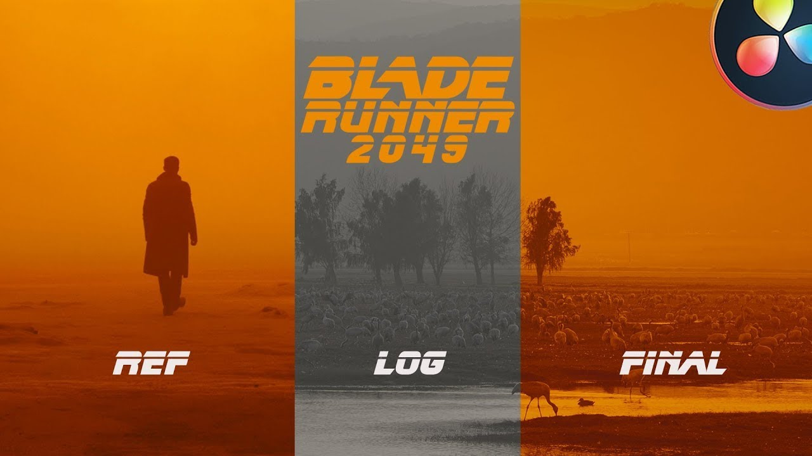
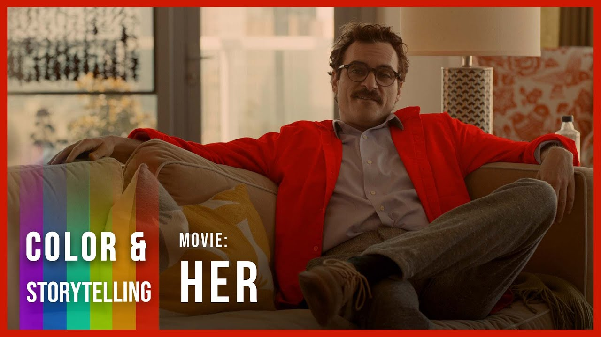

Před **Color-Gradingem** musí přijit <mark style="background: #ABF7F7A6;">COLOR CORRECTION</mark> 
**Color-Grading** pomáhá vytvořit jakýsi mood nebo náladu záběru. Pomocí Color Gradingu, lze dosáhnout velmi uměleckou, futuristickou či medieval podobu snímku. Color correction je naopak oprava barev obrázku, tak aby vypadal jak ze skutečného světa.

**Ideální scénář** je mít všechny záběry dokonale vyvážené, kontrastem, stíny, W&B; ideální scénáře jsou většinou nereálné => úprava v editoru. Jednoduchou možností je nanést tkzv. 
**LUT** Look-up Tables. Lutka je soubor čísel, který přemapují hodnotu obrázku. Jinak řečeno jedná se o filtr, který lze aplikovat. Lutky se vždy aplikují přes Creative panel, tak abychom mohli je mohli lépe upravovat.
Lepší verze jak provést Color Grading je přes 
**Adjusment Layer** - což vytvoří jakési prázdné video; toto nelze aplikovat na všechny záběry, které máme. Pokud například máme záběr z města a z lesa, tak i color grading musí být odlišný. Po aplikaci **Adjustment layer** se nám zobrazí panel **Basic Corection**
*[chybějící obrázek: 97cba68d8b7ade59b8707f0568492b5e.png]*
Ten většinou lze nastavit dle přiložené fotografie, ale každý záběr je jiný a každý záběr požaduje jinou práci.
White Balance -	Pomůže vyvážit barvy v záběru. Pokud je něco příliš oranžové či modré
Saturation - Jak moc živé jsou barvy
Exposure - Jak moc světla má tvůj záběr. Expozice v záporných hodnotách znamená, že záběr bude tmavý. Expozice s vysokými hodnotami zase, že záběr bude neuvěřitelně světlý
Contrast - Zvyšuje rozdíl mezi světlejšími a tmavšími oblastmi obrazu.
Highlights - Jak světlé a kontrasující světlé oblasti záběru jsou.
Shadows - Jak světlé a kontrasující tmavé oblasti záběru jsou.
Whites - Jak světlé a kontrasující bílé oblasti záběru jsou. (Většinou stejné jak Highlights, ale ne vždy).
Blacks - Jak světlé a kontrasující černé oblasti záběru jsou. (Většinou stejné jak Shadows, ale ne vždy).
**Creative Panel**
LUT - Look-up Tables. Lutka je soubor čísel, který přemapují hodnotu obrázku. Jinak řečeno jedná se o filtr, který lze aplikovat. Lutky se vždy aplikují přes Creative panel, tak abychom mohli je mohli lépe upravovat.
Faded Film - Dává jakýsi Film Look, ale je to poměrně nepraktické a lepšího výsledku lze dosáhnout pomocí Curves
Sharpen - Sharpen vytáhne měkké pixely a obráceně.
Vibrance - Dodá jakousi živost matným barvám v obraze.
Saturation - Přidá nebo odebere živost barvám v obraze.
Shadow Tint - Dalo by se říct, že lehce nastavuje barvy stínů do barvy, kam je kolo umístěno.
Highlight Tint - Dalo by se říct, že lehce nastavuje barvy světlých míst do barvy, kam je kolo umístěno.