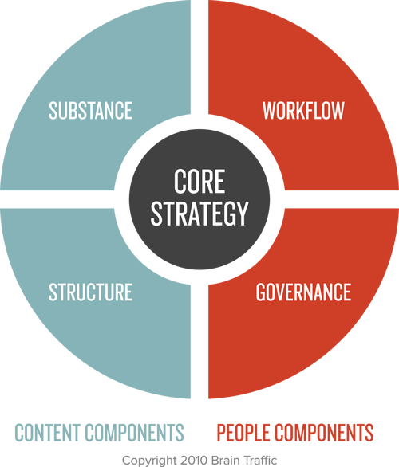

Lidé čtou zhruba jenom 20 procent obsahu na webu což je průzkum z roku 2008, takže dnes to bude ještě menší nejspíš. Takže s obsahem a slovy na obrazovce je důležité brát opatrně; pokud web není efektivní, tak nebudete mít zákazníky, důležité je si je urdžet aby se vraceli zpátky. Obsah je všude od domovské stránky, FAQ, chybové zprávy.

Více kontentu nedělá něco lepší, (avšak to neznamená, že vždy je vhodné se snažit udělat text co nejkratší, jisté případy vyžadují obsáhlější text) o kontentu by se mělo přemýšlet velmi kriticky.
Pomocí změny jednoho slova je možné dokázat naprosto ovlivnit akci uživatele. Například je velký rozdíl mezi "click here", "buy now", "make a purchase", "add to cart".

**Content Strategy**

Obsahové komponenty - Substance (co obsah říká), Structure (jak je organizován)
Lidské komponenty - Workflow (Jak se práce dělá) Governance (Jak je dlouhodobě udržován). Tento přístup zkoumá základní strategii spolu s dlouhodobými cíli pro vytváření a správu obsahu
https://twitter.com/ConfabEvents - odkaz na konferenci Confab. Zkoumá aktuální trendy a problémy ve světe obsahové strategie.

**UX psaní**
ux psaní se zaměřuje na texty, se  kterými se uživatel setká při interakci s produktem

příklad špatného UX psaní, aby se stahování zrušilo musí se kliknout na OK

Text, který vás provede zážitkem, vám pomůže získat jistotu, že produkt, který kupujete, skutečně obdržíte. Pokud by byl text na webu nepříjemný, pravděpodobně byste si mysleli, že je web trochu povrchní, a chtěli byste své podnikání přesunout jinam. Psaní UX však může uživateli pomoci dodat sebedůvěru. K tomu může dojít, když uživatel narazí na kopii, která na další obrazovce odhalí, co může očekávat (informace, které může chtít vědět, ale není vždy zřejmá), potvrzovací obrazovku, která indikuje, že nákup je dokončen (což uživatele ujišťuje, že jeho kreditní karta fungovala), nebo potvrzovací nebo děkovný e-mail (jednoduché gesto, které zákazníkovi ukáže, že společnosti na něm záleží).

Úvodní obrazovky pro meditační aplikaci Headspace pomáhají řídit očekávání a pomáhají uživatelům budovat návyky. Grafické prvky, jako je zubní kartáček, doplňují text, který říká "Po vyčištění zubů"

Více textu není vždy lépe, častokrát se dá text vyjádřit obrázky, videii, grafy, digramy etc.

Efektivní obsah lze tvořit pouze tehdy, pokud rozumíte svým uživatelům. https://openclassrooms.com/en/courses/4555276-conduct-design-and-user-research Tenhle kurz pomůže pochopit jak rozumět určitým skupinám zákazníkům

**UX DESIGN** vždy zaujímá přístup zaměřený na uživatele, je důležité si pamatovat, že JÁ NEJSEM UŽIVATEL, to co platí na mě, nemusí platit na moje zákazníky. Je důležité myslet na to, že uživatel patří na první místo

Dobrý způsob jak se odlišit od konkurence je, že skutečně zaujmete přístup zaměřený na uživatele. Většina produktů nebo webových stránek nabízí až 80% obsahu co uživatele nezájímá a najít pro ně relevantní informace je náročné.

Například aplikace HeadSpace (meditace) se při prvním spuštění ptá, kolik máte zkušeností. To jelikož Vám chce posílat zprávy dle vašich schopností optimalizované právě na vás. S nováčkem se bude zacházet a motivovat jinak než s pokročilým uživatelem. Aplikace vám také posílá oznámení, dle vaši životosprávy, pokud máte čas večer pošle je večer pokud ráno, tak ráno. Tohle je opět personalizace dat, ale nehodí se na vše. Například nabídky na letenky není možné posílat jenom večer nebo ráno, jelikož nabídka již mohla skončit.

Jejich [studie ukázaly](https://www.nngroup.com/articles/plain-language-experts/), že si nikdo nestěžuje, když je text snadno srozumitelný, a že "vysoce vzdělaní online čtenáři touží po stručných informacích, které lze snadno skenovat".
- Rozluštění vyžaduje méně úsilí
    
- Přínos pro všechny (zejména pro mezinárodní publikum)
    
- Lepší výsledky ve výsledcích vyhledávání
**SHRNUTÍ**
- Vezměte v úvahu informace, které uživatel chce a potřebuje v každém kroku toku uživatele.
    
- Nejlepší obsah je komunikován efektivně a přichází ve správný čas.
    
- Přání uživatelů se ne vždy shodují s informacemi, které společnosti a organizace prezentují na webových stránkách.
    
- Zvažte cestu uživatele a to, jak se cítí v každém kroku, abyste vytvořili obsah, který je pro něj užitečný.
    
- Používejte jazyk, kterému snadno rozumí každý, a vyhněte se používání žargonu.

Nejdůležitější je práce se zákazníky, zkoumejte o co jim jde, například i přes sociální sítě, kde můžete skvěle zjistit, co od vás zákazníci očekávají.

**Metriky a analýzy**
O terminologii se dá dozvědět hodně, pokud budeme hledat výrazy, které lidé používají k tomu, aby se dostali na web = google analytics, [Google Trends](https://trends.google.com/trends/). Můzeme se podívat na tomto grafu, který mám hezky ukazuje, které slovo je pro zákazníky nejpřívětivější a nejpoužívanější mezi zákazníky, kteří tuto akci chtejí dokončit.
*[chybějící obrázek: Pasted image 20231122230007.png]*
Důležité je taky myslet na **SEO** neboli optimalizace pro vyhledávače, díky klíčovým slovům vložených do webových stránek. Optimalizací výsledků je větší šance, že se stránka dostane na první příčky vyhledávaní googlu

Tato část je z tohoto článku, kde lze nalézt více informací [Design words with data. How data informs our writing at Dropbox | by John Saito | Dropbox Design | Medium](https://medium.com/dropbox-design/design-words-with-data-fe3c525994e7)

Další možností je **Ngram Viewer**, který prohledává publikované knihy naskenované googlem.

Na **Readability-Score.com** jsou testy, které vám měří jak je snadné poruzmět vašim slovům. Například známka 8, znamená, že žák 8. třídy by měl být schopen porozumět vašemu textu. Také zjistíte kolik průměrně slov má vaše věta **V DROPBOXU SE SNAŽÍ TO DRŽET POD 15 SLOV**

- [Readability-Score.com](https://readability-score.com/)
- [Hemingwayův editor](http://www.hemingwayapp.com/)
- [Kontrola čitelnosti spisovatele](http://www.thewriter.com/what-we-think/readability-checker/)

**SURVEYS**
- [Uživatelské testování](https://www.usertesting.com/)
- [SurveyMonkey (PrůzkumMonkey)](https://www.surveymonkey.com/)
- [Spotřebitelské průzkumy Google](https://www.google.com/insights/consumersurveys/home)

Zde jsou růžné možnosti, kde snadno provést surveys a zjisti tak názor uživatelů
Lidé čtou podle studie na webech ve tvaru #písmenaF, zleva doprava, pak dolů a znovu; pokaždé však o něco méně (Lidské oko čte webovou stránku ve tvaru písmena F tak, že při prvním přeletu očima rychle projede horizontální pruh nahoře a poté se sestupuje dolů po levé straně obrazovky, hledajíc klíčová slova a informace. Poté se oko posune doprostřed obrazovky a opět projede horizontální pruh níže. Nakonec se oko soustředí na levou stranu obrazovky, kde hledá další relevantní informace. Tento způsob čtení je založen na lidské tendenci vyhledávat důležité a zajímavé informace na začátku bloku textu nebo výrazných nadpisech.)

Na slovech záleží v Dropboxu dělali výzkum, kde se ptali uživatelů zda by použili funkci **Select "Remove Local Copy" to save space** - většina lidí řekla, že ne a měli problém porozumět, co jim funkce nabízí, avšak, když uživatelům nabídli možnost **Save space by selecting "Remove Local Copy"** většina uživatelů řekla, že by funkci použila, že jim přijde užitečná a bylo jednodušší funkci porozumět.

**Shrnutí**
- Naslouchejte uživatelům a buďte otevření integraci jejich jazyka do vašeho produktu.
    
- Testy použitelnosti a uživatelský výzkum jsou skvělými nástroji pro pochopení jazyka uživatelů.
    
- Prozkoumejte, jaké vyhledávací dotazy uživatelé používají, aby se dostali na váš web.
    
- Integrujte nadpisy, které pomohou rozdělit informace a usnadní uživateli zjistit, na co se dívá.

**UX writing** se zabývá slovy, se kterými se uživatelé setkávají při interakci s produktem, toto psaní má sloužit k motivaci klienta. V UX může mít několik slov obrovský rozdíl. 
"Je to jako klimatizace v konferenční místnosti. Nikdo nikdy nepřeruší naše schůzky, aby nám řekl, jak příjemná je teplota. Ani si toho nevšimnou. Teploty v konferenční místnosti si všimneme pouze tehdy, když je příliš chladno nebo příliš horko. Nebo si možná všimneme, že je jednotka příliš hlasitá nebo netěsní po celé podlaze. Ale když to funguje perfektně, stává se to neviditelným."

 Pohled Googlu na UX se zaměřuje na Výzkum, Design a Obsahové strategii. Mnoho lidí příkládá Designu největší váhu, avšak jak můžeme vidět na grafu, tak google přikládá designu stejnou váhu jako výzkumu a obshahové strategii.
 Tady Google ukazuje jak malé změny mohou změny můžou mít velký vliv a učinit zprávu jasnější, účinnější, stručnější a užitečnější.

**Microcopy = [Microcopy Patterns (tumblr.com)](https://tinywordsmatter.tumblr.com/)** termín používaný k popisu malých kousků textu, které mohou mít velký dopad na uživatelské prostředí, například slova na tlačítku nebo tip, který vám pomůže obnovit zapomenuté heslo. Podobně i **mikrointerakce** například číslo, které se objeví u nákupního košíku, aby vám připomenulo kolik položek máte v košíku.
Předvídáním toho, co zákazník může potřebovat nám může pomoci zvýšit prodeje, minimalizovat počet výpadku a udělat web,aplikaci přívětivější. Př: Hemingway nabízí možnost platit alternativní metodou, pokud nemáte svoji kartu u sebe, kde také píše securely = což zákazníka psychologicky uklidní.

 
Zvýšení o 17% jelikož Check availability je méně závazkové, a proto na to lidé více kliknou.

**Shrnutí**
- UX psaní se zabývá slovy, se kterými se uživatelé setkávají při interakci s produktem.
    
- Mikrokopie je malý text, který může pomoci řídit zážitek nebo interakci.
    
- Měření změn výkonu v důsledku změn textu může být dobrým způsobem, jak prokázat hodnotu obsahu pro zúčastněné strany.

**Psaní scénářu**
Interaction Design Foundation definuje [**scénáře**](https://www.interaction-design.org/literature/topics/user-scenarios) jako "fiktivní příběh uživatele, který dosahuje akce nebo cíle prostřednictvím produktu. Zaměřuje se na motivaci uživatele a dokumentuje proces, kterým může uživatel průmyslový vzor používat. "Scénáře pomáhají vyprávět příběh a poskytují kontext k tomu, kdy, kde a jak se věci dějí. Kontext a podrobnosti pomáhají vytvořit scénáře z pohledu uživatele. Scénáře nepředstavují všechny možné uživatele, ale mají tendenci zkoumat běžné uživatele a jejich motivace.

Př scénáře
- Kdo je uživatel:
- Proč uživatel přichází na web
- Jaké cíle má uživatel
- Jak může uživatel pomocí webu/produktu dosáhnout svých cílů?
Řekněme, že pracujete na aplikaci, která pomáhá spravovat domácí úkoly. Zde je možný scénář:  
_Jste pracující matka se třemi dětmi, které jsou v různých ročnících. Chcete mít možnost sledovat jejich práci na základě individuálních potřeb._

Následující scénář je poměrně funkční na všechny případy
Jako ... [Kdo je uživatel?]

Potřebuji/chci/očekávám... [Co chce uživatel udělat?]

Aby... [Proč to chce uživatel udělat?]

Když [nastane konkrétní situace]

Chci [provést akci nebo něco zjistit]

Abych mohl [dosáhnout svého cíle...].

Avšak scénář není možné aplikovat na všechno. Scánáře jsou individuální a musí být různorodé podle scénáře.

### Audity 
- Nenahlížejte na text jako jednu informaci, ale jako na část celku. Uvažujte o celém obsahu
-<mark style="background: #FF5582A6;"> Pokud začínáme nový projekt je dobré udělat audit konkurence, ne abychom jim nápad vzali či kopírovali design, ale abychom porozuměli jak ostatní pracují s daným tématem.</mark>
-  
- Ukázkový audit
	- ID - id stránky přidělené číslo může sloužit jako navigace v projektu 0 - Home 1.0 - další stránka 1.1 podstránka
	- Page title - název stránky
	- URL -adresa
	- Comments - komentář, informace co třeba ponechat, doladit, postřehy co například na stránce chybí
- Po dokončení auditu můžeme vidět vzorce, které nám pomohou, můžeme si všimnout, že se nějaký seznam opakuje na více místech, nebo najít chyby.
- **Audity nám pomohou jak přistupovat k obsahu dále a co je třeba udělat**

#### Shrnutí
- Audity obsahu představují způsob, jak katalogizovat obsah na vašem webu.
    
- Audity obsahu jsou nástrojem, který vám pomůže strategičtěji přemýšlet o výběru obsahu.
    
- Tabulky jsou nejlepším způsobem, jak dokumentovat audity obsahu.
    
- Vzorce se objeví provedením auditu obsahu, který vám pomůže informovat o vašich dalších krocích.

**Typy obsahu**
	- **Interface copy/kopie rozhraní** - text, který se zobrazuje na tlačítkách, odkazech, navigaci, formulářích, vyskakovací okna, varování, chybové oznámení... jedná se o mikrokopy i o UX psaní
	- **Release note** - jedná se o text, který oznamuje nové fukce systému, aplikací při aktulizaci
	- **Marketing copy** - psaní propagačních materiálů, popisů produktů, blogových příspěvků, sociálních médií a tiskových materiálů. Pro každý kontent je důležité zvážit obsah z pohledu uživatele; je zaměřen na nové uživatele? Na někoho, kdo už je platící uživatel
	- **User generated content** - může zahrnovat recenze, komentáře, posudky. Budování vztahů s uživateli může být velmi přínosné, pokud chcete integrovat obsah vytvářený uživateli.
	- **Cuarated content** - značky zvou blogery, aby upravovali články a obsah, který pomůže zaujmout jejich publikum. Tím, že přivedete zvučná jména, je cílem přilákat na web také nové uživatele
	- **Aggregated content** - obsah automaticky převzat z jiných webů 
	- **Licensed content** - obsah (články, video, zvuky) z jiných zdrojů jako je Creative Commons = [Homepage - Creative Commons](https://creativecommons.org/)
	- **Support content** -  je obsah, který mohou servisní týmy použít k reakci na požadavky, včetně formulářů obsahu, předpřipravených odpovědí (není třeba pokaždé začínat od nuly!), informací o centru nápovědy a technické dokumentace.
		- FAQ se dá dnes využít i jinak, a celkově FAQ je poměrně neefektivní, pokud koukneme třeba na amazon, je to zde mnohem lépe vyřešeno [Help & Contact Us - Amazon Customer Service](https://www.amazon.com/gp/help/customer/display.html)
	- **Terms of services and policies** - bývají drobným písmem ve spodní části stránky, které by měl zkontrolovat právní tým. Jako spisovatel chcete přispět k tomu, aby to bylo pro uživatele co nejpřístupnější tím, že napíšete "jednoduchou angličtinou", ale nakonec bude mít poslední slovo právo.
	- **Internal communications** - může být užitečná pro komunikaci v rámci týmu, onboarding nových zaměstnanců nebo školení ostatních o nástroji. Pro týmy mohou být velmi užitečné příručky stylů, příručky nebo příručky pro psaní souhrnů produktů nebo pokyny pro používání aktiv značky.

 **Skici**
Je dobré si vždy obsah naplánovat dopředu, je mnohem jednodušší kreslit novou skicu, než předělávat nový web

1. Uveďte účel a požadované výsledky stránky nebo toku, abyste mohli vyhodnotit nejdůležitější obsah.
    
2. Promyslete si, co budou uživatelé od obsahu potřebovat, a případné dotazy.
    
3. Spolupracujte se svým týmem, abyste určili skutečné téma a témata, kterým se musíte věnovat.
    
4. Pomocí témat určete skutečný obsah a ta nejdůležitější umístěte na začátek. (Začněte s lepicími papírky a během práce diskutujte o každém tématu.)
    
5. Vytvořte skutečný redakční program, designový směr a specifikace a získejte zpětnou vazbu od uživatelů a zúčastněných stran k ověření obsahu.
