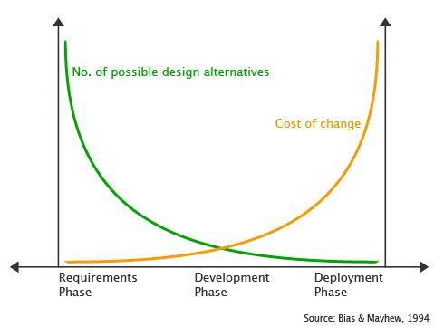
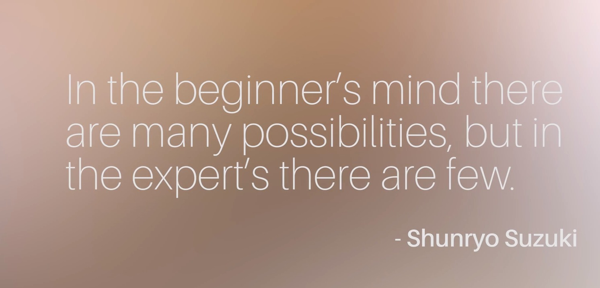
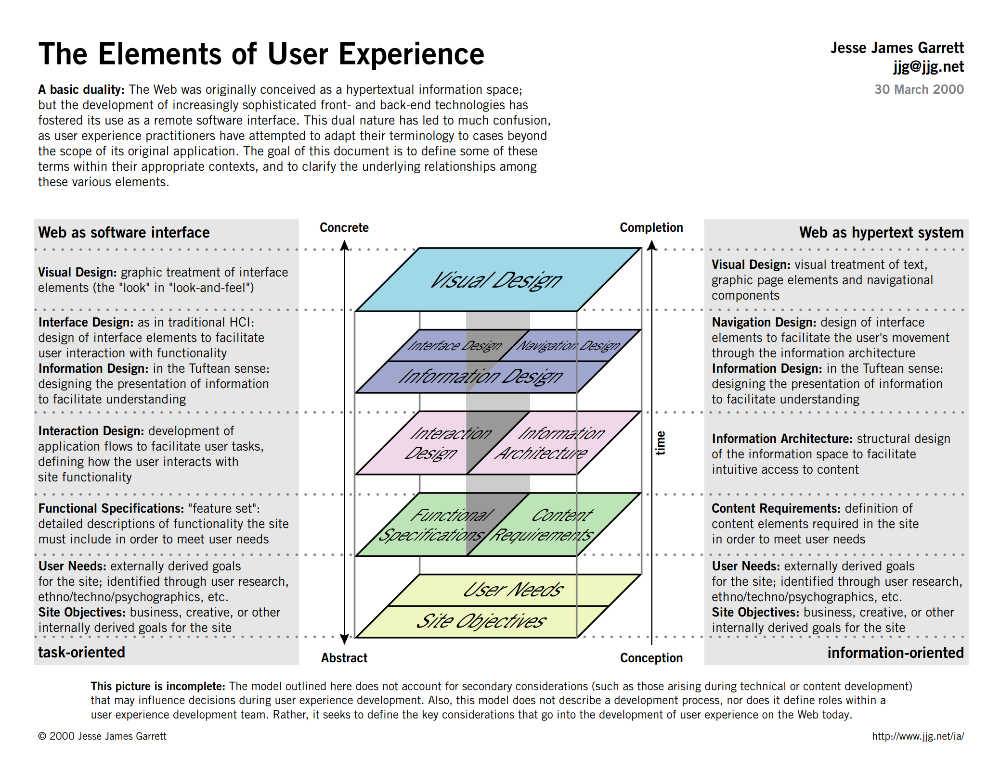

UX je všude kolem nás
- ovladač na TV
- ovládání v autě
- MHD
- Samoobslužné pokladny v lidlu
- Aplikace a technologie
- I tohle poznámky, pokud bych je někomu poslal
Jako UX designer je potřeba **proniknou k uživatelům pro produkt**, zjistit jak fungují, zjistit jejich potřeby a vzorce chování. Dělat si poznámky ohledně UX

**Čím dále se dostanete do procesu návrhu, tím dražší je provádět změny**, proto je důležité zvážit všechny procesy návrhu již v rané fázi procesu a průběžně testovat nápady. 

UX **popisuje jeden citát**, je důležité být otevřený nápadům, učit se z chyb a klást otázky.
 

Je důležité jít do projektu s myslí začátečníka. Neboli koukat na projekt myslí uživatele, který o **UX neví vůbec nic**, tím je možné vidět více chyb a pomoc tak uživateli.

- **Ptejte** se a **nepředpokládejte**
- **Poslouchejte**: opravdu naslouchejte, ne jen předstírejte
- **Zapojte empatii** a podívejte se na perspektivu uživatele
- Odstranit úsudek
- **Ptejte se na všechno** – dívejte se na svět jinými způsoby
- Kontextualizace přehledů
- **Buďte zvědaví** (pokorní) - otevřená mysl vás dovede daleko!
- **Smiřte se s tím, že nevíte všechno**
- Pamatujte: **neexistují žádné hloupé otázky**
- Upřednostněte **otázky** před odpověďmi

Mapa **UX prvků** zmapovaná Jessem Jamesem Garrettem
- **Vizuální designer/Grafický designer/UI designer** - pracuje na vizuálním nebo grafickém zpracování, které dává projektu vzhled a dojem
- **Informační architekt** - dívá se na to, jak jsou informace strukturovány a organizovány (navigace na webových stránkách)
- **Návrh interakcí** - bere v úvahu způsob, jakým lidé interagují s produkty a rozhraním
- **Výzkumník v oblasti designu** - získává porozumění prostředí a chování uživatelů prostřednictvím výzkumu (obvykle v terénu, známý jako etnografie), může také provádět testování použitelnosti
	- Etnografie je vědní disciplína, která se zabývá popisem a studiem kultur a společností. Etnografové provádějí terénní výzkumy, během nichž pozorují a zaznamenávají zvyky, tradice, hodnoty a chování dané skupiny lidí. Etnografie se také často zaměřuje na vztahy mezi lidmi a jejich prostředím, na ekonomické a sociální struktury, náboženské praktiky atd. Etnografický výzkum může být prováděn různými metodami, jako jsou rozhovory s informátory, pozorování a záznamy událostí nebo sběr historických materiálů.
- **Tester použitelnosti** - testuje prototypy a produkty na skutečných uživatelích, aby zjistil, zda bylo dosaženo požadovaných cílů, aby bylo možné lépe pochopit, jak lze produkty vylepšit
- **UX writer/content strategy** - vyskakovací okno, chybová hláška, newsletter
- **Front-end vývojář** oživuje digitální produkty prostřednictvím kódu
- **Produktový manažer** - rozhoduje o tom, co by se mělo postavit, jaké problémy tým řeší, jaká je vize produktu a jaký obchodní model se použije
- **Jednorožec** - umí všechno a přihlíží ke všemu

### Tech-term v UX odvětví
- **Product** – věc, kterou vytváříte (může to být aplikace, web nebo nová funkce)
- **"Ship it"** – uvedení produktu nebo verze na trh
- **"Roll out"** – postupné zavádění nových funkcí produktu (také dává vývojovému týmu více času na reakci, pokud se vyskytnou nějaké problémy, které je třeba opravit)
- **Dev** – zkrácený termín pro "vývoj", který může být také označován jako inženýrství nebo programování
- **Stand up** – schůzka, na které účastníci stojí, aby byla krátká a k tématu; Je to způsob, jak poskytovat aktualizace nebo řešit problémy se členy týmu
- **Výstupy**; **Deliverables** – vše, co vývojář potřebuje k vytvoření produktu (může zahrnovat obrázková aktiva, písma, barevná schémata, průvodce styly, drátěné modely atd.)
- **Dokumentace**; **Documentation** – komentovaný záznam o aktualizacích a změnách
- **Wiki** – místo, kde může kdokoli ve firmě najít informace o projektu nebo úkolu
- **MVP** – minimální životaschopný produkt, což je základní produkt nezbytný ke spuštění (další funkce mohou být zavedeny později)
- **"Mobile first"** – když jsou mobilní zařízení upřednostněna před webovými stránkami jako střed pozornosti návrhu a vývoje
- **Agilita**; **Agile** – styl projektového řízení, který pracuje tak, aby se věci rychle hýbaly
- **Plán**; **Roadmap** – celkový plán výzkumu, výroby a expedice produktu
- **KPI** – Klíčové ukazatele výkonnosti
- **CTO** - Technický ředitel
- **Stakeholder** – každý, kdo je spojen s projektem a kdo se musí podílet na rozhodování
**Poslech podcastů je skvělý způsob, jak se blíže seznámit s oblastí UX**. Zde je několik oblíbených (konkrétní epizody uvidíte zmíněny v budoucích kurzech):

- [UX Blog Podcast](https://medium.theuxblog.com/ux-podcast/home): – rozhovory s profesionály o jejich kariéře, aktuálních trendech a žhavých tématech
    
- [Co je špatného na UX?](https://www.usersknow.com/podcast) – rozhovory (a debaty) o designu uživatelského prostředí
    
- [Engsplaining](https://podbay.fm/p/engsplaining): – rozhovory mezi produktovým manažerem a vývojářem
    
- [DesignBetter.Co](https://www.designbetter.co/podcast): – podcast od InVision s lídry v oblasti designu
## Vznik UX
Za otce UX se často označuje Don Norman - studoval inženírství a psychologii. V roce 1988 napsal knihu **Psychologie každodeních věcí** z čeho se později stalo
**Design každodeních věcí**
	Podle Normana je UX= všechny aspekty interakce koncových uživatelů se společností, jejich servisem a produkty = UX kouká na celý systém používání a **interakcí uživatele s produktem**, než jenom celkový design produktu
	Knihu napsal po svém tripu do Anglie, kde nevěděl jak otevřít dveře, zapnout vodu etc.
**Emocionální Design**
	Je důležité myslet během designu na to, jak chceme aby se naši zákazníci cítili
	**Díky kvalitnímu designu se cítíte šťastně** = zároveň je proto důležité sledovat trendy a co se děje v oboru.
Charakteristikou dobrého designu je
	**Porozumění** - aby uživatelé zjistili jak produkt používat
	**Zjistitelnost** - Znamená, že je možné zjistit, jaké akce jsou možné - kde a jak tyto akce lze provádět = hrneček ucho na držení, otvor na pití
		**Viditelnost** - když je funkčnost jasná a viditelná, je pravděpodobnější, že uživatelé budou vědět, co dělat dál
		**Zpětná vazba** - na každou akci existuje zpětná reakce.
		**Omezení** - akce jsou omezeny tak, aby uživatel věděl co má dělat a nebyl přehlcen a frustrovaný
		**Mapování** – vztah mezi dvěma sadami prvků, které signalizují příčinu a následek. (Například ovládací panel nebo rychloměr)
	    **Konzistence** – existuje podobnost mezi návrhovými rozhraními a úkoly, takže uživatel rozumí možným akcím. (Tlačítka vypadají jako tlačítka, posuvníky vypadají jako posuvníky.)
	    **Afordance** – vodítko, které uživateli umožňuje porozumět vztahům: co dělat, jak se objekt používá a co je možné. (Signifikátory sdělují signály o tom, jak design používat.)
		    Afordance je něco co vypadá jako to, co má dělat
			    Ucho hrnečku
			    Klika na dvěřích u auta
			    Klika na dveřích
			    Ostatní drát - víte, že tam nemáte chodit
Dobrý design má feedback = zvuk, animaci, akci atd.
	Dveře, které stojí za hovno a není jasné jak je otevřít se jmenují Norman Door - dveře, které vám říkají co máte dělat a přitom to vypadá, že máte dělat opak (napsáno push, ale vypadá to jako, že máte pull) jsou všude, dobré dveře nepotřebují nápis pull, push, mělo by rovnou být jasné jak dveře otevřít.

