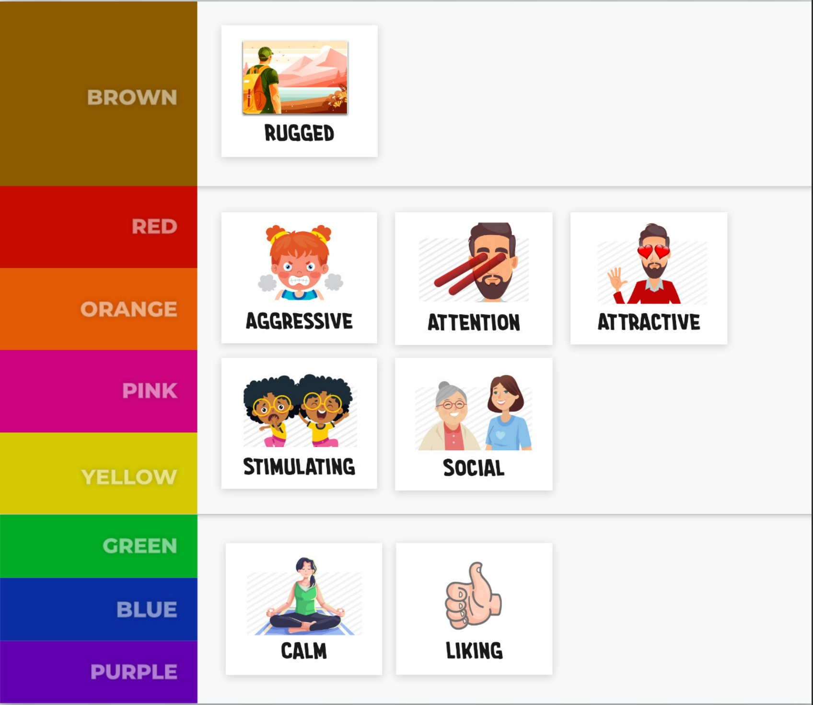
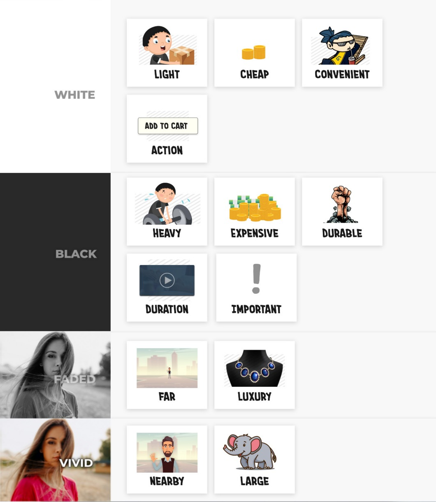

# Psychologie barev

Jaké asociace barvy vyvolávají a proč nejsou univerzální napříč kulturami.

Související: [Teorie barev](color-theory.md) · [Kontrast a barva](../pravidla/kontrast-a-barva.md) · [Luxury](../kontext/luxury.md)

Psychologie barev **se zabývá  vlivem barev na lidské chování, nálady a emoce.** Tento obor zkoumá, **jaké pocity a asociace vyvolávají různé barvy** u jednotlivých lidí a jak se dají tyto poznatky využít například při designování interiéru, marketingových kampaní nebo terapii.

Psychologie barev není univerzální, to znamená, že různě po světě mohou barvy působit naprosto jinak, ať už díky asociacím, tak kultuře, náboženství. Příkladem může být **<mark style="background: #00000000;">ČERNÁ</mark> barva** v US,EU ji máme spojenou se zármutkem a truchlení. Avšak v někde v Asii je <mark style="background: #FFFFFFFF;">BÍLÁ</mark> barva brána jako truchlící a Jižní Africe je to <mark style="background: #FF5582A6;">červená</mark>.

Další příklad je <mark style="background: #BBFABBA6;">zelená</mark> v USA barva bohatství a peněz kvůli barvě dolaru
### Působení barvy na lidi
- Barva na nás může působit různými styly, můžeme se cítit smutní, pozitivní, motivovaní, hladoví etc.
- Toto můžeme například vidět na logech fastfoodu, kde používají barvy, které má zelenina (jídlo) a tím evokují hlad
	- <mark style="background: #FF5582A6;">ČERVENÁ</mark>  
		- Většinou spojena s intenzivními pocity, **je to odvážná volba při tvorbě značky**; dává elementu vyniknout
			- <mark style="background: #BBFABBA6;">láska</mark>, <mark style="background: #BBFABBA6;">energie</mark>, nebezpečí, oheň, <mark style="background: #BBFABBA6;">síla</mark>, <mark style="background: #BBFABBA6;">autorita</mark>, sebejistota
	- <mark style="background: #FFB86CA6;">ORANŽOVÁ</mark> 
		- Energie jako červená, ale není tak drsná, odvážná; často používána pro **značky cílící na mladé generace**, připoutavá a přitažlivá, zároveň svěží
			- <mark style="background: #BBFABBA6;">nadšení</mark>, zábava, <mark style="background: #BBFABBA6;">mládí</mark>, <mark style="background: #BBFABBA6;">kreativita</mark>, <mark style="background: #BBFABBA6;">radost</mark>, jídlo
	- <mark style="background: #FFF3A3A6;">ŽLUTÁ</mark> 
		- **Jednoduchá na viditelnost na dálku** v kombinaci s tmavými tóny, hodně šťastných asociací
			- <mark style="background: #BBFABBA6;">energie</mark>, <mark style="background: #BBFABBA6;">štěstí</mark>, <mark style="background: #BBFABBA6;">povzbuzení</mark>, optimistická a přitahuje pozornost
	- <mark style="background: #BBFABBA6;">ZELENÁ</mark> 
		- Spojována s přírodou a v US s penězmi; **hodně záleží na tónu zelené**
			- <mark style="background: #BBFABBA6;">zdraví</mark> (zdravé jídlo, zdravý životní styl...), <mark style="background: #BBFABBA6;">klid</mark>, přírodou (zeměkoulí), <mark style="background: #BBFABBA6;">ekologie</mark>, <mark style="background: #BBFABBA6;">udržitelnost</mark>
	- <mark style="background: #ADCCFFA6;">MODRÁ</mark> 
		- Podobné uklidňující kvality jako u zelené, ale jenom **ve světlejších tónech**
			- <mark style="background: #BBFABBA6;">důvěra</mark>, <mark style="background: #BBFABBA6;">věrnost</mark> (loyalty), <mark style="background: #BBFABBA6;">bezpečí</mark>, vědomosti, znalost, luxus, <mark style="background: #BBFABBA6;">profesionalita</mark> = **ovb** 
	- <mark style="background: #D2B3FFA6;">FIALOVÁ</mark> 
		- Je zároveň **tmavá i světlá**; **teplá i studená**, podobná modré, ale <mark style="background: #FF5582A6;">NENABÍZÍ STEJNÝ KLID</mark>; dělá jakýsi pocit **tajemství nebo nejistoty** = technologické společnosti
			- <mark style="background: #BBFABBA6;">tajemno</mark>, <mark style="background: #BBFABBA6;">léčení</mark>, magie, moc, <mark style="background: #BBFABBA6;">péče</mark> (ve smyslu SPA, kosmetiky), bohatství, <mark style="background: #BBFABBA6;">luxus</mark>, pýcha, <mark style="background: #BBFABBA6;">hrdost</mark>
	- <mark style="background: #FFB8EBA6;">RŮŽOVÁ</mark>
		- Růžová byla tradičně označována se ženskostí a většinou cílena na ženy; ale **dnes už to tak není**. Je více hravá, rebelistická
			- <mark style="background: #BBFABBA6;">Hravá</mark>, vzpurná, <mark style="background: #BBFABBA6;">odvážná</mark>, láska, <mark style="background: #BBFABBA6;">laskavost</mark>, <mark style="background: #BBFABBA6;">pomoc</mark>, <mark style="background: #BBFABBA6;">feminita</mark>, zdravý, nevinný
	- <mark style="background: #964B00;">HNĚDÁ</mark> - pravdou (pravdomluvnost, honesty), přírodní a naturální produkty, spolehlivostí, healing
	- <mark style="background: #CACFD9A6;">ŠEDIVÁ</mark> - neutralita, komunikace (sdělení), klid
	- <mark style="background: #00000000;">ČERNÁ</mark> 
		- může zářit jasněji než jakýkoli jiný tón; je to zároveň neutrální i provokující, matná, ale zároveň zářivá.
			- <mark style="background: #BBFABBA6;">Luxus</mark>, <mark style="background: #BBFABBA6;">bohatsví</mark>, síla, <mark style="background: #BBFABBA6;">čistota</mark>, <mark style="background: #BBFABBA6;">progesivita</mark> disciplína, <mark style="background: #BBFABBA6;">elegance</mark>
	- <mark style="background: #FFFFFFFF;">BÍLÁ</mark> - 
		- Minimalistická barva, vnáší space do celkového designu
			- <mark style="background: #BBFABBA6;">čistotou</mark> (neviností, purity), <mark style="background: #BBFABBA6;">čistotou</mark> (ukliteno, čisto, budoucnost), světlem, dobrá energie, <mark style="background: #BBFABBA6;">mír</mark>, <mark style="background: #BBFABBA6;">balanc</mark>, jednoduchost ale i sofistikovanost, <mark style="background: #BBFABBA6;">minimalistická</mark>, <mark style="background: #BBFABBA6;">space</mark>

