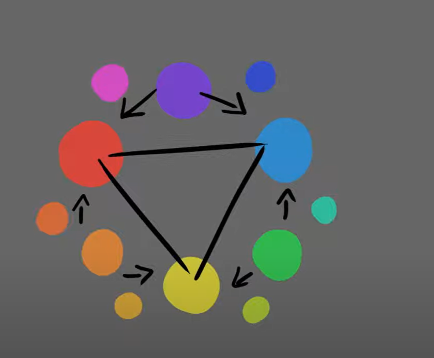
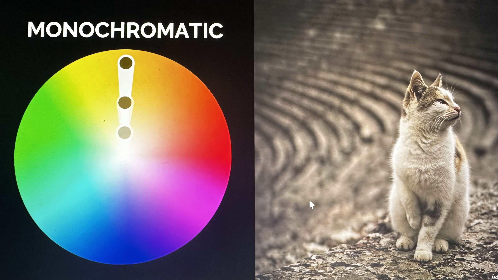
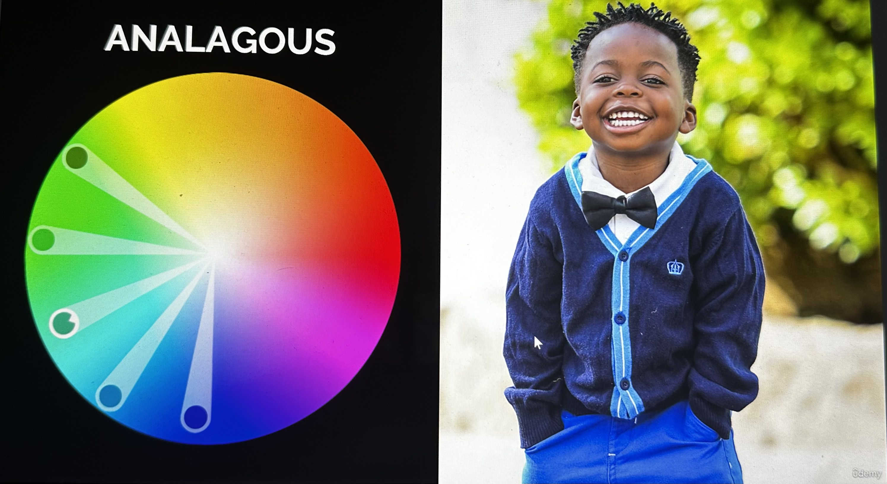
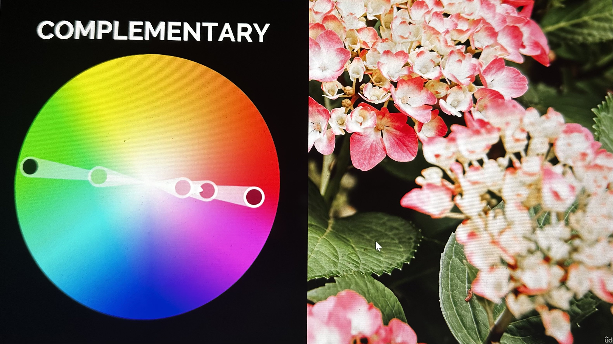
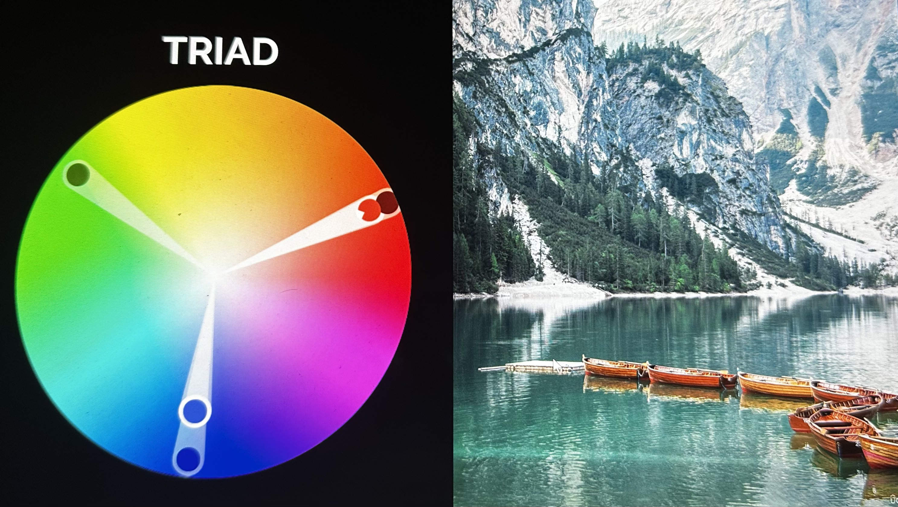
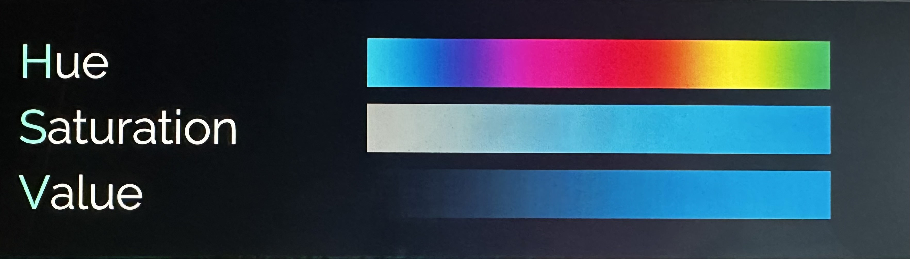
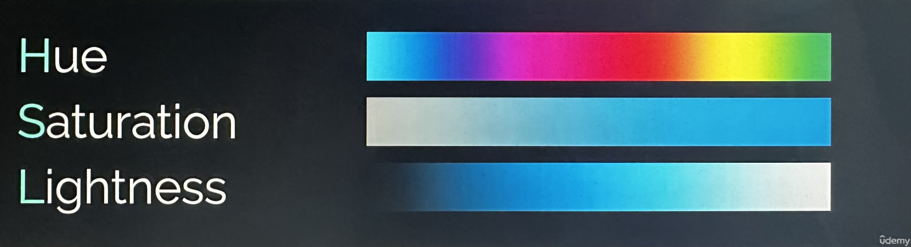
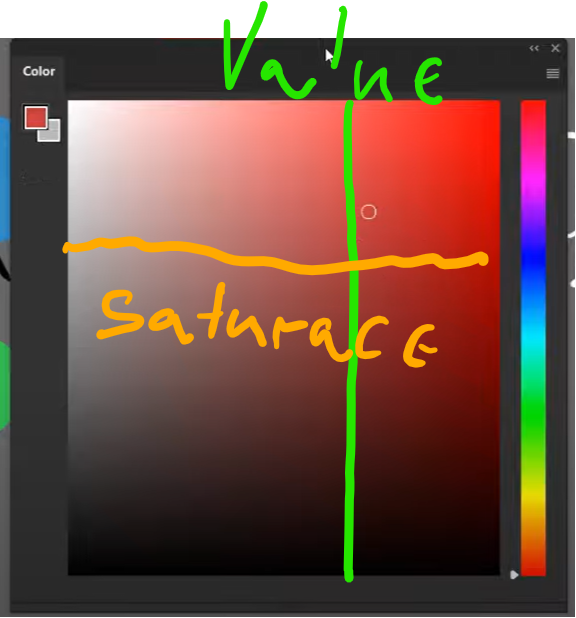
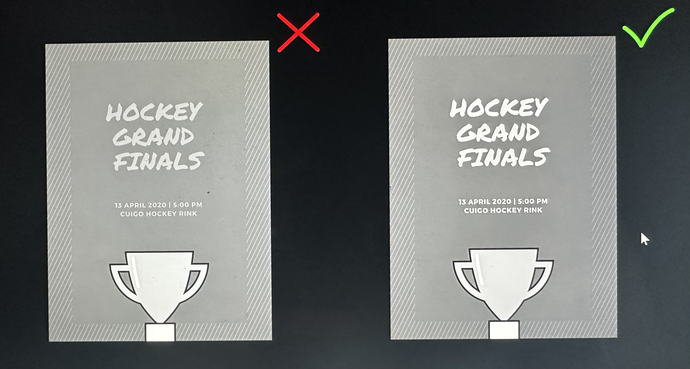
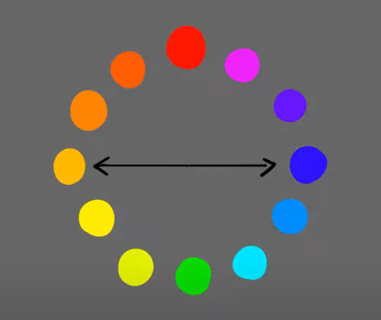

# Teorie barev

Barevný kruh, harmonie, saturace, value, kontrast a nástroje na výběr palety.

Související: [Kontrast a barva](../pravidla/kontrast-a-barva.md) · [Pravidlo 60-30-10](pravidlo-60-30-10.md) · [Psychologie barev](color-psychology.md)

Barva je vlastnost, kterou vidíme, když reaguje se světlem a dalšími objekty. Jednoduše řečeno světlo se dotkne objektu a to buďto absorbuje světlo a nebo ho reflektuje zpátky do našeho

## Základní barvy - neboli primární barvy
**Červnená**
**Modrá**
**Žlutá**

**Sekundárníbarvy** = když **barvy vedle sebe namícháme společně**
§
Zelená = žlutá a modrá
Oranžová = žlutá a červená
Fialová = červená a modrá

**Terciální barvy** = stejný princip jako sekundární, zase barvy vedle sebe spojíme

### Působení barvy na lidi
- Barva na nás může působit různými styly, můžeme se cítit smutní, pozitivní, motivovaní, hladoví etc.
- Toto můžeme například vidět na logech fastfoodu, kde používají barvy, které má zelenina (jídlo) a tím evokují hlad
	- **ČERVENÁ** - láska, energie, nebezpečí
	- **ORANŽOVÁ** - nadšení, umění, jídlo
	- **ŽLUTÁ** - štěstí, povzbuzení, a přitahuje pozornost
	- **ZELENÁ** -zdraví (zdravé jídlo, zdravý životní styl...), klid, přírodou (zeměkoulí)
	- **MODRÁ** - důvěra, věrnost (loyalty), bezpečí
	- **FIALOVÁ** - bohatsví, luxus, pýcha, hrdost
	- **HNĚDÁ** - pravdou (pravdomluvnost, honesty), přírodní a naturální produkty, spolehlivostí, healing
	- **ŠEDIVÁ** - neutralita, komunikace (sdělení), klid
	- **ČERNÁ** - sílá, disciplína, elegance
	- **BÍLÁ** - čistotou (neviností, purity), čistotou (ukliteno, čisto, budoucnost), světlem, dobrá energie

## Color Harmony

Monochromatická - barevná paleta bude mít jiné tints (termín "tints" označuje odstíny nebo tóny barvy, které vznikají přidáním bílé barvy k základní barvě) a stíny jedné barvy.

Analogus - barvy mají jiné hues a tak tvoří větší škálu barev, což se většinou používá na teplé a studené palety

Complementary - to jsou barvy, které jsou přímo naproti sobě (180 stupnu), barvy se vzájemně doplňují, a skvěle se hodí na různé tipy designu

Triad - 3 barvy, jsou stejnoměrně rozmístěny napříč color wheelem, což vytváří jistou harmonii

## **Pojmy**
#### Hue 
= odstín barvy, představme si, že u růžové posuneme Hue do prava, tak přejdeme na fialovou. Hue je jednoduše barva, reflektované světelné vlny, které vidíme v našem oku = což pak jmenuje červená,modrá, žlutá
	**HSV** 
		
	**HSL**
	
### **Saturace** 
= sytost barvy její **intenzita**; Vysoká saturace bude plná červená, nízká saturace bude světlá červená, která přejde až do bílé
### Value 
= neboli jak je barva světlá nebo tmavá, viz obrázek nahoře

### Kontrast
=kontrast je rozdíl v saturaci, hues a values. Kontrast může probíhat mezi komplimentárními barvami a nebo i mezi value hodnotami; pokud je kontrast vysoký pomáhá to elementu vyniknout, pokud je malý, tak to pomáhá elemtu splynout. Kontrast můžeme zjistit pokud obrázek dáme do **greyscalu**
Nejvíc podstatné informace většinou potřebují vyšší kontrast.

**Teplota barev**
	-**Teplé barvy = Červená, žlutá, oranžová**
	-**Studené barvy = Modrá, zelená, fialov**á
	-**Studené X Teplé vedle sebe tvoří pěkný kontrast na oči**
**Komplimentární barvy** = barvy co jsou na barevném kole naproti sobě a mají největší kontrast; pokud se použijou společně, tak vypadají velmi příjemně na pohled

**Analogové barvy** = barvy co jsou vedle sebe na kole a hezky spolu ladí. Lze kombinovat společně Analogové a Komplimentární

**RGB** Red, Green, Blue - barvy, které oko vidí a díky ním přesvědčí mozek, že je více barev. Na tomto principu fungují monitory, zobrazují ruzné množství red green a blue
Tyhle barvy se zkombinují a pak se zobrazí v pixelu
  
Většina tiskáren používá při tisku model barev známý jako CMYK (Cyan, Magenta, Yellow, Key/Black). CMYK je speciálně optimalizován pro tisk, kde se barvy kombinují a míchají na papíře nebo jiném tiskovém médiu.

Na druhou stranu, RGB (Red, Green, Blue) je model barev používaný v digitálních zařízeních, jako jsou monitory, fotoaparáty a displeje. RGB je založen na aditivním míchání světla a používá tři základní barvy (červenou, zelenou a modrou), které se kombinují pro vytváření široké škály barev.

Při tisku je třeba konvertovat barevný prostor z RGB do CMYK, což může vést ke změnám barev a vzhledu, protože CMYK nemůže reprodukovat všechny barvy dostupné v RGB modelu. Je proto důležité mít na paměti omezení barevných prostorů při přípravě souborů pro tisk a provádět správné barevné konverze.

### Pixel Density
	PPI = pixel per inch
	PPC = pixel per centimer
		Tohle číslo udává jak hustě jsou pixely zhuštěny do určité velikosti; 
		Obraz který má 10x10 pixelu a je 2 cm (inch) dlouhý by měl 5PPC
		Čím víc PPC máme na našem obrázku tím víc smoother obraz bude díky hustotě pixelů (density of pixels)
		Rozlišení 1920x1080 vypadá skvěle na smartphonu, protože pixely jsou zhuštěny do malého místa, ale například na velkých obrazovkách bude toto rozlišení vypadat rozmazaně
			Tisk funguje na principu DPI = dots per inch, kolik teček pigmentu bude položeno na papír na jeden inch
			Pokud tiskneme chceme mít vysokou kvalitu a moc nezáleží na velikosti souboru, takže používáme klidně **300** DPI a více
	Ale když děláme web design etc. tak chceme mít nízkou velikost souboru, s čím nejmenším obětování kvality. **Klasické nastavení PPI pro design je 72**
### Bit depth
= jak moc barvy může být uloženo v obrázku
	**1 Bit** = jenom dvě barvy, černá a bílá
Většinou ale používáme 8 16 nebo 32 bitu 
	**8 BITU= 256 = PRO WEB DESIGN**, COŽ JE 256 PRO ŠEDOU, ČERVENOU, ZELENOU A MODROU COŽ JE PŘES 16 MILIONU VARIACI BARVY
	**16 BITU= 65 536 = TISK**
	**32 BITU= 16 777 215 = VELKÝ TISK**

### Hexadecimal code
00 00 00 - tří bitová hodnota, které pomáhají vybrat barvu ve web designu

**Duo Tone** - Multi Tone tisk s individuálními barevnými chanely

### Gradient 
- přelití různých barev a paternů; jde o postupnou změnu barvy nebo hodnot přes určitý prostor. Jedná se o prvek, který 
	- Ve Photoshopu klikneme na Layers panel a vybereme Gradient map, což se zaměří na všechny hodnoty bílé a černé a aplikuje tam barvu

## Vybírání barev pro projekt
- Zákazník buďto řekne jaké barvy chce použít
- Zkusíme se zamyslet jak chceme aby obrázek působil, jaké vyzařoval emoce
	- Scénář UX writingu (logo restaurace)
		- Kdo je klientela:
		- Co to je za místo, snackbar, fine dinning, fastfood...
		- Budget klienety
		- Jaké jídlo klient hledá
		- Jaká je konkurence
	
### Dobré nástroje
**Adobe Color** - [Barevný kruh, generátor barevné palety | Adobe Color](https://color.adobe.com/cs/create/color-wheel)
**Colour Palets v Pinterestu** - můžeme najít inspiraci od někoho kdo už vytvořil nějakou grafiku a postnul tam svoje palety
**Color Palets Generator Canva** [Color palette generator | Canva Colors](https://www.canva.com/colors/color-palette-generator/)
Colour Contrast - chech contrastu různých barev - [Colour Contrast Checker](https://colourcontrast.cc/)
Pro vybírání palet barev - [ColorSpace - Color Palettes Generator and Color Gradient Tool (mycolor.space)](https://mycolor.space/)
[Realtime Colors](https://www.realtimecolors.com/?colors=050315-fbfbfe-2f27ce-dedcff-433bff&fonts=Poppins-Poppins)
