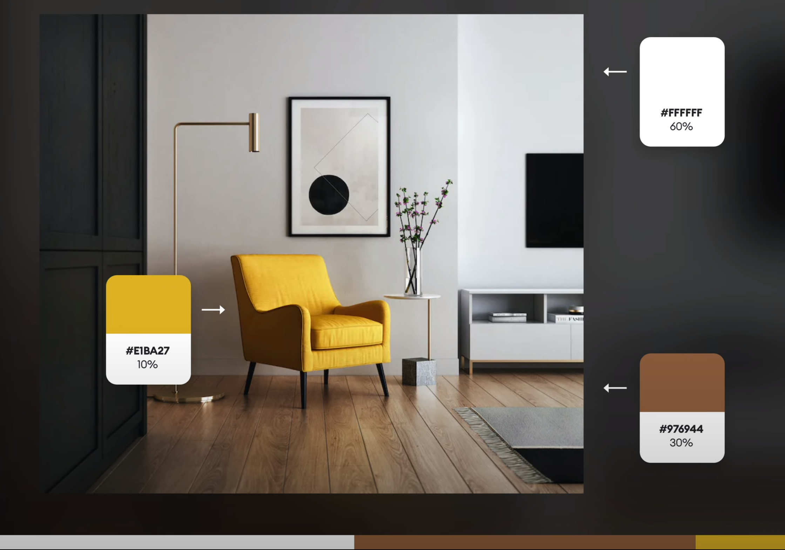

# Pravidlo 60-30-10

Poměr neutrální, primární a akcentní barvy v paletě.

Související: [Teorie barev](color-theory.md) · [Kontrast a barva](../pravidla/kontrast-a-barva.md) · [Anti-slop](../pravidla/anti-slop.md)

Hodně často používáno v interier designu, ale také funguje dost dobře v UI

60% = **je naše neutrální barva** nebo base color = většinou neutrální, creamy, white, dark
30% = **primární barva** to může být brand color - **Red Jest Grey Color**
10% = **Call to action** color = barva <mark style="background: #ABF7F7A6;">look at me, click at me etc.</mark>

Nejbezpečnější cesta je jít s barvami jako v prvním příkladu. 60% bílá, 30% text černá, 10% call to action barva

Chat GPT dokáže vygenerovat 60-30-10 barvy, ale poslední barva musí mít **POP;WOW efekt** - pokud to bude <mark style="background: #ABF7F7A6;">mrtvá modrá</mark>(Tahle), tak to nebude fungovat. Fungují dobře barvy co mají **vysokou saturaci** a jsou útočné (sytě modrá, lime green, sytě žlutá etc.); barva by měla mít tak **90% saturace, 90% brightness** a **vyvarovat** se hue <mark style="background: #FF5582A6;">H40-H120</mark>

**Příklady**

What is 60 30 10 rule in web design

 The 60-30-10 rule in web design refers to a guideline for creating a visually appealing and balanced color scheme. The rule suggests using a dominant color for 60% of the design, a secondary color for 30%, and an accent color for the remaining 10%. This helps to create a cohesive look that is both aesthetically pleasing and easy on the eyes.