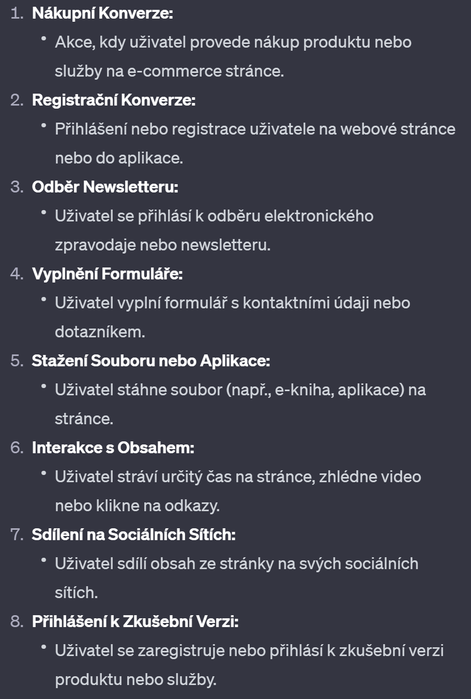
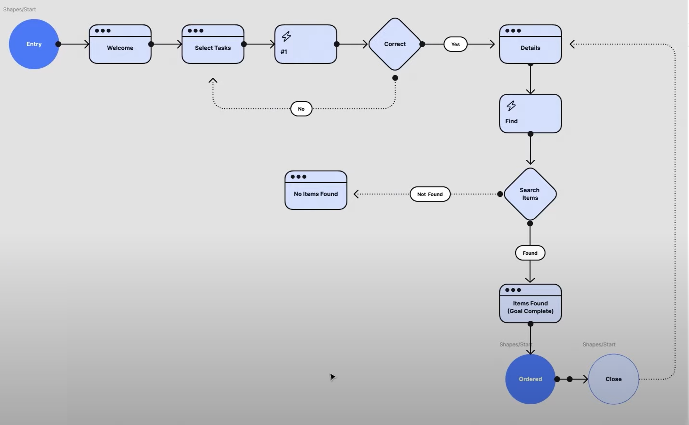
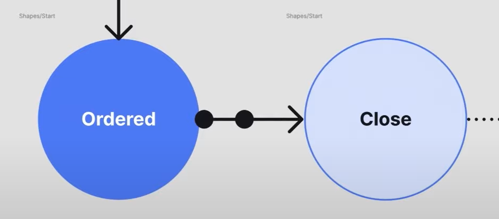
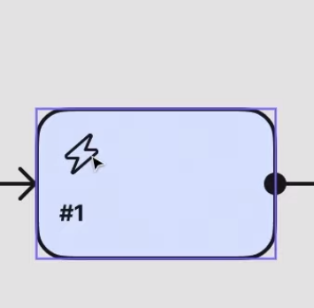
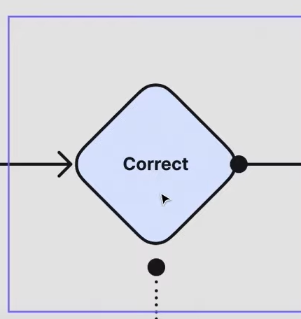
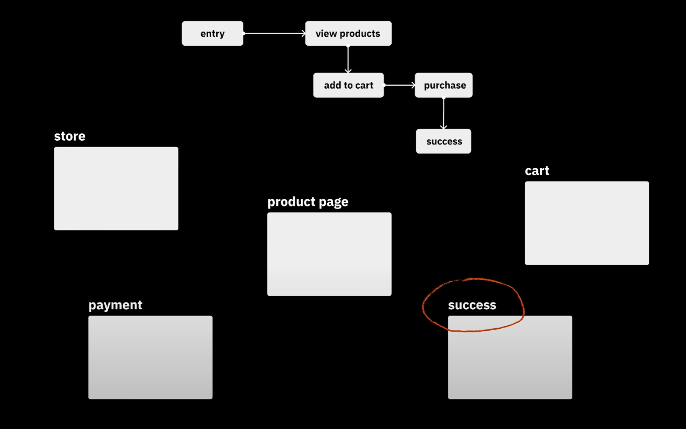
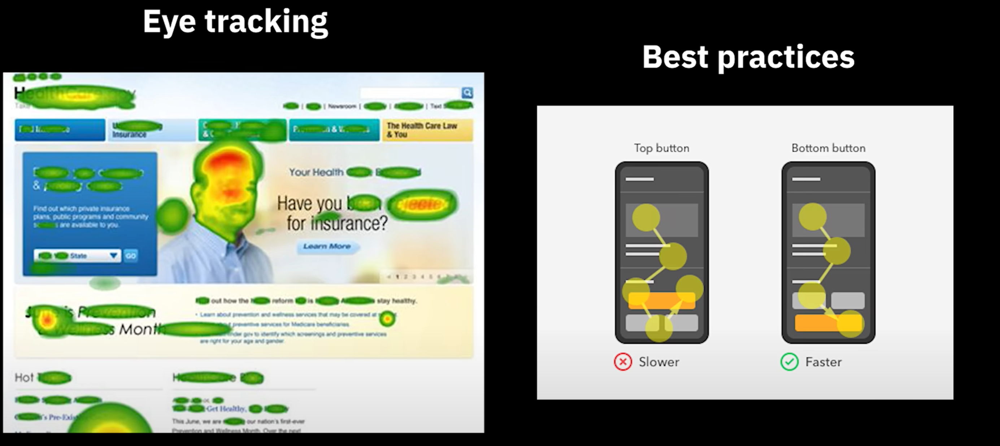

# Step by step: UX/UI web a app design

Celý postup od user flow po iteraci. Otevři na začátku větší stavby.

Související: [Definice problému](../ux-zaklady/define-the-problem.md) · [Poznej své uživatele](../ux-zaklady/understand-your-users.md) · [Discovery](../ux-zaklady/discovery.md) · [Designový proces](../ux-zaklady/design-process.md) · [Metody UX výzkumu](../ux-zaklady/design-research-methods.md)

 UX má spousty kroků, záleží na složitosti produktu, ale většina kroků jsou nějak v takovémto pořadí
	1.Understand
	2. Reserech
	3. **User persona** - fiktivní charakteristika reprezentující typického uživatele produktu nebo služby
		1. k lepšímu porozumění potřebám, cílům, chování. Vytváření zahrnuje následující prvky
			1. **Demografické info** = věk, pohlaví, vzdělání, zaměstnání
			2. **Cíle a motivace** = čeho chce uživatel dosáhnout a proč
			3. **Chování** = typické chování uživatele = nákupní chování
			4. **Překážky a výzvy** = čemu může čelit při používání produktu
			5. **Technologická preference** = mobil, ipad, počítáč
			6. **Emoce a postoje** = co může prožívat v souvislosti s produktem nebo službou a jeho obecné postoje
	4. User Journey - více v **User Flow**
	5. User Flow
	6. Information architecture
	7. Surveys
	8. Ideate - napadání a generování nápadu; hledání kretivního řešení
	9. Lofi wireframing - jednoduché a hrubé náčrty, slouží k vizualizaci struktury a rozložení prvků na stránce
		1. **Cíl:** Rychle zachytit základní strukturu designu a uspořádání prvků.
	10. Hifi wireframing - Lofi wireframi jsou vylepčení o detalnější grafiku, barvy, fonty
		1. **Cíl:** Poskytnout detailnější náhled na vizuální aspekty designu a možné interakce.
	11. Prototyping - vytvoření interaktivních modelů produktu, které umožňují uživatelům simulovat reálné interkace; statické (neinteraktivní), dynamické (interkativní)
		1. **Cíl:** Poskytnout detailnější náhled na vizuální aspekty designu a možné interakce.
	12. Usability testing - provádění testů reálnými uživateli k vyhodnocení, jak efektivní a přívětivý je navržený produkt nebo design
		1. **Cíl:** Zjistit, jak uživatelé interagují s designem a identifikovat potenciální problémy nebo oblasti vylepšení.
	13. **A/B testing** - porovnání dvou nebo více variant designu nebo obsahu s cílem zjistit, která verze dosahuje lepších výsledků = jaké jsou konverze (žádaný cíl, které chce podnik dosáhnout od svých uživatelů), uživatelská angažovanost nebo retence.
		1. **Cíl:** Poskytnout empirická data na základě reálných uživatelských reakcí a preferencech pro optimalizaci designu.		
	14. Iteration and feedback - zdokonalování designu na základě zpětné vazby od členů týmu
	15. Implementation - převedení do skutečného produktu
	16. Real-world testing
	17. Product lifecycle - reágování a změny v potřebách uživatelů po spuštění produktu
	18. User documentation - vytvoření dokumentace a průvodců pro uživatele, které jim mohou pomoci poruzumět
	19. User Training -poskytování podpory uživatelů
	20. Monitoring and Analytics - monitorování analýz a metrim, abyste porozuměli tomu, jak uživatelé interagují
	21. Optimazition - na základě zpětné vazby provádět úpravy a optimalizovat
##  1. User Flow
<mark style="background: #FF5582A6;">1. KROK Mapování</mark>
	Musíme zmapovat uživatele, klienta, který na **stránku přijde**, to děláme pomocí **USER FLOW DIAGRAMU**
		1. Určit svůj cíl a cíl uživatelů
		2. SEO - určit jak náštěvnící najdou webové stránky, a jak najdou na nich obsach
		3. Určit jaké informace uživatel potřebuje a kdy je potřebuje
		4. Zmapovat tok uživatelů
			1. Identifikace cílové skupiny - typ uživatelů
			2. Definování cílů - Hlavní cíle, kterých uživatelé chtějí dosáhnout při používání služby
			3. Vytvoření person - "falešní uživatelé" a jejich osobnosti, které reprezentují různé typy uživatelů
			4. Vytvoření mapy - popisuje, jak uživatel na stránce postupuje
			5. Analýza chování uživatelů
			6. Identifikace klíčových bodů - identifikace klíčových interakcí, které mohou ovlivnit uživatelský zážitek
			7. Optimalizace cesty - vytváření a implementace změn, které zlepší uživatelský zážitek
			8. Testování
		5. Zpětná vazba
	Představme si, že náš web je jako **haunted house escape room**,  musíme vědět jak se naši hosté pohybují, abychom věděli kde vypustit strašidla, do jakých míst je nahnat atd.
		**Tok uživatele neboli User Flow** - všechny interakce, které by uživatelé měli mít na stránce, UX tým musí určit, jak se uživatelé mají pohybovat k přihlédnutím potřebám uživatele
		**Cesta uživatele neboli User Journey** - je celá cesta uživatele, ne pouze na naši stránce, ale začíná vyhledávním na googlu, pokračuje na různé weby a pak klidně na náš web. User Flow je část User Journey
	Proč používat <mark style="background: #ADCCFFA6;">User Flow Diagram</mark> =Poté co se zamyslíme nad zákaznickou zkušeností a potřebami uživatelů, abychom zjistili tok webu nebo aplikace. Abychom zajistili co nejlepší podmínky pro uživatele je důležité zmapovat a vizualizovat
		Diagram nám pomůže udělat návrh dopředu, aby bylo jasné jak má design postupovat, a ne ho pote menit na konci
**Příklad**
	Řekněme například, že prodáváte software pro sledování rozpočtu. Vaši zákazníci budou pravděpodobně postupovat podle fází AIDA na následující cestě přes váš web:
		**AWARENESS = Upozornění** - návštěvník vstoupí na web a dostane se na "zplaťte kreditku rychleji" landing page
		**INTEREST = Zájem** - scrolluje a dostane se na video, jak pár zaplatil dluh 100 000 debt
		**DESIRE = Touha** - Klikne na stránku o ceně softwaru, přemýšlející jak super by bylo zbavit se všech dluhů
		**ACTION = Akce** - návštěvník zakoupí software
	Pokud bychom nechápali, co chce návštěvník získat a co mu předat z každé strany, tak bude frustrovaný, že nemůže informace najít a ze stránky odejde. Pokud však pečlivě připravíme User Flow, maximalizujeme jejich zážitek na webu.	
	<mark style="background: #BBFABBA6;">2 DRUHÝ KROK Vytváření Diagramu</mark>
	**Určete svůj cíl a cíle svých uživatelů**
	1. Kdo jsou moji uživatelé
		1. **Příklad**: Pokud jste provozovatel online obchodu s oblečením, vaši uživatelé mohou zahrnovat mladé dospělé, kteří hledají trendy oblečení.
	2. Určit co uživatel chce, jaké jsou jejich cíle na stránce
		1. **Příklad**: Cíle uživatele mohou zahrnovat nákup nového oblečení, nalezení slev nebo získání informací o velikostech a materiálech.
	3. Jaký je hlavní scénář, jakým způsobem by měli dosáhnout svých cílů 
		1. **Příklad**: Scénář pro nákup oblečení může zahrnovat vyhledání položky, přidání do košíku, provedení platby a potvrzení objednávky.
	4. Které kroky jsou nejzásadnější pro každý scénář
		1. **Příklad**: Klíčové kroky pro nákup mohou zahrnovat snadné vyhledání produktu, pohodlné dokončení objednávky a jasné potvrzení platby.
		2. Klíčové kroky, které uživatel musí provést k dosažení svých cílů
	5. Které stránky nebo obrazovky jsou zásadní - jaké informace by na nich měly být k dispozici
		1. **Příklad**: Zásadní stránky mohou zahrnovat domovskou stránku, stránky s produkty, stránku košíku a stránku potvrzení objednávky.
	6. Které akce mohou uživatelé podniknout na každé stránce
		1. **Příklad**: Na stránce s produkty mohou uživatelé vyhledat, filtrovat, zobrazit podrobnosti o produktu nebo přidat produkt do košíku.
	7. Jaké jsou možné odchylky nebo chyby v uživatelském toku - **mysl začátečníka =**  problémy nebo odchylky, které by uživatel mohl zažít
		1. **Příklad**: Uživatelé mohou zažít odchylky při platbě, například chybně zadané platební údaje nebo problémy s ověřením.
	8. Jak můžete vylepšit uživatelský zážitek = pomocí zpětné vazby a testů
		1. **Příklad**: Na základě zpětné vazby můžete zlepšit uživatelský zážitek přidáním jasných navigačních odkazů, poskytováním informací o dostupnosti produktů a optimalizací procesu platby.
	**Jak návštěvníci najdou Vaše stránky = SEO**
		Pokud se snažíte vylepšit již vytvořený web nebo aplikaci, prozkoumejte data. Služba Google Analytics rozdělí procenta pro jednotlivé následující způsoby zadávání:
			Přímá návštěvnost
			Organické vyhledávání
			Placená reklama
			Sociální média
			Odkazované stránky
			E-mail
		Zvažte, co tyto různé vstupní body vypovídají o vašich uživatelích a jak můžete lépe přizpůsobit prostředí tomu, co potřebují. Tyto vstupní body budou začátkem vašeho diagramu toku uživatelů.
<mark style="background: #FFF3A3A6;">3. KROK Identifikujte, jaké informace vaši uživatelé potřebují a kdy je potřebují</mark>
		Poskytnout správné informace v danou chvíli
			Opět se ptáme na otázky, a vstupujeme s **myslí začátečníka**
<mark style="background: #FFB86CA6;">Jakou akci bych měl na této stránce provést, pokud bych byl zákazník</mark>
<mark style="background: #ABF7F7A6;">				Jak se orientuji v procesu placení</mark>
<mark style="background: #D2B3FFA6;">Kdybych byl tento typ zákazníka, jak bych se cítil ohledně tohoto videa s doporučením</mark>
<mark style="background: #FF5582A6;">Zvažte, co zákazník od konkrétní stránky očekává, co může cítit a v jakém je rozpoložení</mark>

<mark style="background: #D2B3FFA6;">4. KROK Tvoření Diagramu</mark> 
Příklad Diagramu vytvořeného ve figmě
	Kolečka - **Start, End, Finální akce**
	Obdelníky - **obrazovka**
	Obdelník s bleskem - **mezi krok akce mezi obdelníkem a diamantem**
	Diamant - **vždy stejné** - reprezentuje rozhodování
	Plné čáry - **z jednoho screenu do druhého**
	Přerušovaná čára - **alternativní možnost**
	Tagy - **co se stane**
Standart UML - **podívat se**

1. Entry point - bere se jako vstup, že jsou v aplikaci či na webu - na webu jich může být několik, social media, reklama a může nás to nasměrovat na různé stránky = **kolečka symbolizují nějakou akci**
	1. U aplikace je to jednodušší = musí být stažena a pak zapnuta, začátek bude vždy stejný
2. Steps to completion - všechny ostatní body už jsou kroky k finishy, dokončení úkolu/nákupu/zjištění informace atd.
3. Final destination - Dokončení cesty z A do B
	1. Tady vidíme, že final point je dokončení objednávky
 4. Rectangle - symbolizuje step nebo obrazovku (stránku, display screen) - ty tečky v nich jsou jako reprezentace obrazovky
	 
	 Blesk vevnitř symbolizuje, že se stala akce (každý používá jiné označení)
5. Diamant - ten se ve světě UX používá **stejně vždy** a reprezentuje rozhodování (rozhodovací diamant) = yes/no **;** up/down **;** select/not select **;** approve/not approve
6. **Keep it simple** - ať se lidi soustředí na zprávu a ne na design, jako u wireframu
7. **Labels musí mít smysl** - Ne dát do rectanglu jenom screen, ale co je to za screen - nákup, detaily, o nás, select task, welcome. Stejné u tagu, ne jenom decision, ale je to yes/no nebo approve/not approve - třeba u serach rectanglu = **found**
7. **Labels musí mít smysl** - Ne dát do rectanglu jenom screen, ale co je to za screen - nákup, detaily, o nás, select task, welcome. Stejné u tagu, ne jenom decision, ale je to yes/no nebo approve/not approve - třeba u serach rectanglu = **found/not found**
## 2. Wireframes
<mark style="background: #FF5582A6;">1. KROK Obecná teorie</mark>
	Z user flow diagramu začneme tvořit wireframy, každý diagram by měl odpovídat jednomu screenu wireframu.
	
	Wireframy vyžadují dost přemýšlení a promýšlení nad uživatelským chováním, zde je pár příkladů uživatelského chování
	
	Je to něco jako architekt kreslí návrhy domů.
	**Wireframe obsahuje, kde se nachází každý element**