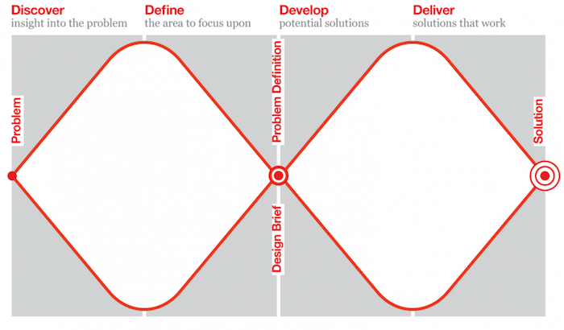
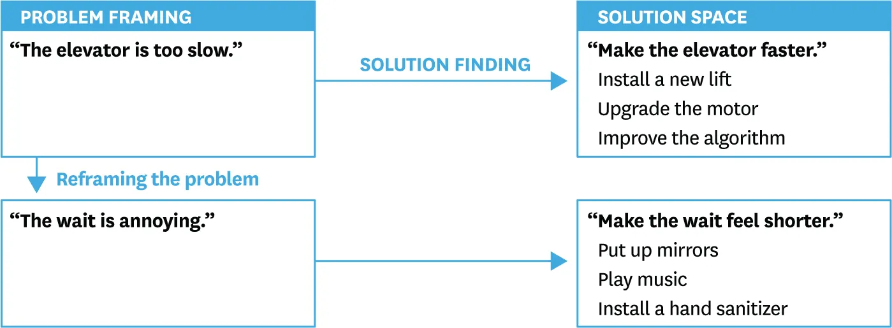

# Definice problému: Double Diamond a 5x proč

Jak zjistit, že řešíš správný problém, než začneš navrhovat řešení.

Související: [Discovery](discovery.md) · [Poznej své uživatele](understand-your-users.md) · [Designový proces](design-process.md) · [Step by step](../proces/step-by-step-ux-ui.md)

**Double diamond** (Dvojitý diamant)
	Způsob jak prozkoumat proces navrhování
	Rodělen do čtyř fází
		Objevování
		Definování
		Vývoj
		Dodávaní
		**První fáze** = Objevování/Výzkum a Definování/Syntéza
		 je považováno za **divergentní myšlení**; touto fází odhalují vhled do problému, kde myšleny rozvíjíme všechny možné myšlenky => poté přecházíme do **konvergentního myšlení**, kde problém zpřesňujeme a definujeme
		 <mark style="background: #BBFABBA6;">Objevování/Výzkum</mark>
			**Rip the Brief** (zpochybnění zadání) - zpochybnění a vyhodnocení každé části. Hledání možností jak rozšířit perspektivu a identifikovat klíčové oblasti zájmu
			**Seskupení/Zjištení** - Seskupování získaných informací do témat a kategorií. Získání přehledu a připravení na syntézu
			**Primární a sekundární výzkum** - Aplikace metod primárního (terénního) a sekundárního (deskového) výzkumu = použití široké škály pro získání prespektivy
			**Stažená nezpracovaných zjištení**
			<mark style="background: #BBFABBA6;">Definování/Syntéza</mark>
			**Podobnosti** - seskupení podobných prvků a identifikace klíčových vzorů.
			**Nalezení vhledů** - hledání hlubšího porozumění motivacím, přáním a frutrací uživatelů
			**Oblasti** - formulace potenciálních oblastí pro další akce nebo inovace
			**HMW otázky** („How might we") - "Jak bychom mohli..." => hmatatelným akcím nebo řešením dané oblasti
		**Druhá fáze** = Vývoj/Nápad
		zatímco první fáze se zaměřuje na nalezení a definování správného problému, druhý diamant se zaměřuje na nalezení správného problému
<mark style="background: #BBFABBA6;">Vývoj/Nápad</mark>
Nápady - **divergentní myšlení** => vytváření nápadů, volný průběh nalezení řešení
Konec fáze - na konci fáze vyčleňte pouze užitečné nápady, lze to udělat pomocí bodového hlasování nebo matice proveditelnosti
	1. **Objevování /Výzkum** – vhled do problému (divergující)
	2. **Definovat/Syntéza** – oblast, na kterou se zaměřit (konvergence)
	3. **Vývoj/nápad** – potenciální řešení (rozcházející)
	4. **Dodat / Implementace** – řešení, která fungují (konvergence)
**Jen proto, že klient říká, že něco je problém, nemusí to být nutně problém, který je třeba řešit.** Součástí procesu návrhu je zjistit, zda pracují na správných cílech. - V designu se často používá oblíbený citát připisovaný automobilce Henrymu Fordovi. Řekl: "Když se zeptáte lidí, co chtějí, řeknou, že chtějí rychlejšího koně." S ohledem na potřeby svých zákazníků místo toho vyrobil auto – a nazval ho Mustang!

Pokud klient přijde s problémem, není to vždy to, co je potřeba vyřešit. Je nutné se dostat ke kořeni problému => pomocí výzkumu

<mark style="background: #BBFABBA6;">Jedním z nejlepších způsobů jak zjistit, že řešíte správný problém je zeptat se 5x proč</mark>
_Co jste si naposledy koupili online?_

- Kniha

_Proč jste si ho koupili online?_

- Byla to speciální kniha.

_Proč jste si ji neobjednali v knihkupectví?_

- Rád podporuji místní podniky, ale tentokrát to potřebuji na akci a naposledy, když jsem si přes ně objednal knihu, trvalo to přes měsíc.

_Proč rádi podporujete místní podniky?_

- Dělá mi dobře, že mohu podporovat místní ekonomiku. Také se mi líbí nezávislé butiky, spíše než jen velké krabicové obchody.

_Proč nemáte rádi velké krabicové obchody?_

- Jsou bez osobnosti a malým podnikům ztěžují přežití.

Řešení správného problému je klíčový faktor, jak zajistit uspokojení koncových uživatelů a zároveň i financérů a ostatních. Zde příklad na výtahu

Vždy je nutné se **PTÁT**
<mark style="background: #BBFABBA6;">JAKÝ JE PROBLÉM UŽIVATELE, KTERÝ SE SNAŽÍME VYŘEŠIT</mark>
