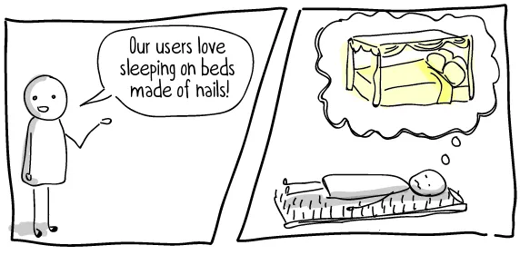

# Metody UX výzkumu

Jaké metody použít na jakou otázku o uživatelích.

Související: [Discovery](discovery.md) · [Poznej své uživatele](understand-your-users.md) · [Designový proces](design-process.md)

"Práce, která odhaluje a vyjadřuje potřeby jednotlivců a/nebo skupin s cílem strukturovaně navrhnout produkty a služby."
	Design Research neboli designový výzkům nám umožňuje a poskytuje strukturovaný, metodický přístup k pochopení našich uživatelů;
	
	Díký Researchy jsme schopni:
		**Ověřit předpoklady**
		**Snížit náklady**
	Ukázalo se, že dřívější modely nakupování Online nejsou správné. Lidé nechodí po jedné cestě, ale občas odbočí někam, abychom něco zažili; právě výzkum nám může pomoci pochopit tyto odbočky
Při výzkumu nám jde převážně o tyto 3 věci
	**Objevit zákonitosti a neznámé poznatky**
	**Stanovit cíle, vytvořit hypotézy a vyvodit závěry**
	**Vytvořit možnou budoucnost (pro uživatele)**
Identifikujte vzorce chování, jakým způsobem lidé reagují na rozhrání, jak plní úkoly, které po nich žádáme (koupit, registrovat, like), zkušenosti/zážitky, které po nich žádáme, aby sdíleli
### Jak na to?
Vytváříme hypotézy a testujeme je, ale tyto hypotézy lze měnit i za běhu = úspěch podle výsledků, kterých dokážeme
	**Kategorie metod testování**
		Kvalitativní a kvantitativní
		Generativní a hodnotící
		Behaviorální(Chování) a postojové
	<mark style="background: #BBFABBA6;">Kvalitativní a Kvantitativní</mark>
	**Kvantitativní** metody jsou ty co lze spočítat - čas na stránce, procento uživatelů odebírající newsletter, zobrazení stránek, toky uživatelů, čas do dokončení úkolu. Tyto testy většinou lze provádět pomocí Analytiky nebo se pustiti do - porovnání dvou nebo více variant designu nebo obsahu s cílem zjistit, která verze dosahuje lepších výsledků = jaké jsou konverze (žádaný cíl, které chce podnik dosáhnout od svých uživatelů), uživatelská angažovanost nebo retence. Tyto testy jsou většinou úspěšné velkým množstvím dat.
	**Kvalitativní** - pronikají do citů, pocitů, chování, postojů a emocí, to lze dělat například pomocí **diary studies** pomocí kvalitních **soft skills** 
Tyto dva styly výzkumů by se daly označit jako 2 strany téže mince, vzájemně se doplňují.	
<mark style="background: #BBFABBA6;">Generativní a hodnotící</mark>
	Generativní = Počátky myšlenky
	Hodnotící = Je to co budujeme správné? A jde to správným směrem?
<mark style="background: #BBFABBA6;">Behaviorální(Chování) a postojové</mark>
	Rozděluje výzkumné metody do dvou dimenzí
		Jaké názory má uživatel na službu nebo produkt?
		Jak uživatel skutečně komunikuje s produktem nebo službou?
	Záleží na situaci, občas pro nás bude důležitější co si uživatel myslí, ale v jiných, co skutečně dělají
<mark style="background: #BBFABBA6;">Design Research Metods</mark>
	**Safari Service** - vydáte se do přírody a zažijete službu na vlastní kůži. Bývá snažší pokud pracujete ve velké organizaci. = všímejte si interakcí
	**Focus Groups** - zahrnuje setkání uživatelů, kteří hovoří o produktu nebo službě. Někdy je kritizována, protože má tendenci zdůrazňovat skupinové myšlení a neidentifikuje "neuspokojené potřeby"
		- Může být efektivní způsob jak začít pracovat na projektu, může být užitečné dát dohromady skupinu **potencionálních uživatelů**, aby diskutovali o nápadech = otestovat předpoklady týmu, začít získávat data, nápady na produkty
		- Neklaďte moc velký spoleh na zjištění, slouží spíše jako zpětná vazba na nápady, a pomůže činit strategická rozhodnutí
		- Spojte účastníky z různých segmentů, každý segment může reagovat jinak a mít jiné nápady/požadavky = př. čtečky knih jeden segment = kompaktní zařízení = tyto hodně cestují, druhý segment = větší obrazovku = doma
		- Nepřímejte účastníky, kteří jsou si moc podobní nebo moc rozlišní
		- Více než dvě osoby, ale ne více jak 6 lidí = v dobré skupině účastnící komentují ostatní nebo rozvádějí téma
		- Mějte UX plán = stanovte obchodní cíle, výzkumné cíle, mít nějaké hlavní otázky
		- Pozvěte lidi, aby sledovali skupinu = pomůže zachytit více myšlenek. Skupina balancuje na hraně chaosu
	**Interviews** - Diskuze s uživateli jsou velmi cenné, zaměřte na hlubší pochopení uživatelské **motivace, cílů, emocí a zázemí** - avšak měli by se používat pouze v případech, kde generují validní data jelikož = To co uživatelé říkají a co dělají se v 90% liší
		- Kritickým bodem této metody je, že chceme aby lidé sdělili minulou myšlenku = lidská pamět je omylná a nepamatuje si detaily nebo spekulovali o budoucnosti projektu = mají problém si představit novou technologii na základě popisu
		- Jediným časovým bodem, co generuje reálná data v rozhovorech je přítomnost
		- Je lepší použít rozevírací nabídku nebo sadu přepínačů pro určitou sadu voleb? = takové informace **během pohovoru nelze zjistit**
		- V jedné slavné studii Microsoft požádal zákazníky, aby navrhli nové funkce pro Office 2007 před zahájením práce na tomto produktu. Většina požadovaných "nových" příkazů již existovala v Office 2003, takže tým návrhářů správně dospěl k závěru, že jejich hlavním problémem je zjistitelnost stávající funkcionality.
		- **Interviews** nám, ale mohou poskytnou **dobrou** zpětnou vazbu, **co si myslí o webu po jeho použití**
		- Nebo prozkoumat **obecné postoje uživatelů**
		- **Metoda kritických incidentů (CIT):** Požádejte uživatele, aby si vzpomněli na konkrétní případy, kdy čelili obzvláště obtížnému případu nebo kdy něco fungovalo obzvláště dobře. Tyto extrémní případy jsou často v myslích uživatelů živější a poskytnou vám podrobnosti potřebné k tomu, abyste přišli s užitečnými funkcemi.
		- Může se stát, že díky otázce způsobíte v uživateli ještě větší zmatek a vyjádří se k něčemu na co by normálně nepomyslel = zeptáte se na design a kritizuje barvy, avšak při běžném používání by je nějak velce nezaznamenal
	**Surveys - dotazníky, průzkumy**
		- Na získání rychlého přehledu
		- Dva problémy při průzkumu
			Vzniká odchylka pravdivě vyplněných otázek, i přesto, že nabízíte odměnu. - vlastní příklad, naklikám vždy první možnost, protože to nechci číst
			Je těžké klást otázky, tak aby jste našli odpověď co hledáte
		- Ptejte se ohledně nedávných zážitků
		- Pozor na používání více otázek v jedné otázce. Př. Jak rádi byste si koupili jízdenku použití ipadu? Telefonu? Tabletu? Samsungu?...
		- **Ať není repetetivní** a ať nemá zbytečně moc možností odpovědí
		- Zaměřte se na to, aby uživatel mohl odpovědět, tak jak skutečně chce.
			Byli jste spokojeni s používáním naší služby?
				Ano
				Ne
			Mnoho uživatelů bylo něco mezi, či chtějí zanechat extra komentář, proto by bylo vhodné doplnit možnost **Jiné** = přemýšlejte myslí začátečníka-uživatele
		- Ptejte se na to, co vážně potřebujete, zbytku se zbavte = **způsobuje frustraci a uživatel survey opustí.**
		- Rozhodněte se, jak moc odpovědí budete potřebovat
		- Prvně průzkum vyzkoušejte s kolegy
	**Directed storytelling**
		Vytvoření  scénáře, který se odehrává a ten je následně předán uživateli, aby ho vyřešil/vyjádřil se k němu. Tím ho směřujeme směrem, abychom dostali odpověď na konkrétní problém
		1. Zadání otázek = kladení konkrétních otázek nebo témat
		2. Doplňující otázky - **PROČ** T:Jak jsi se cítil? U:Dobře T: PROČ? (T-Tazazel U-Uživatel)
		3. Analýza - zkoumání vzorů, témata, emocionální aspekty vyprávění 
		Může být použito při tvorbě **user person** = abychom hluboce pochopili motivace a potřeby uživatelů.
	**Diary Studie**
		Dokumentace myšlenek uživatele, který prochází určitým zážitkem
		Prostřednictvím deníku od účastníků, kteří zaznamenávají své zážitky, myšlenky a interakce v **REÁLNÉM ČASE** = hlubší náhled do každodenního života s produktem
			**PRO**
				Dlouhodobý pohled
				Hluboké porozumění
				Přirozené prostředí
			**CONS**
				Zaškolení uživatelů
				Nábor
				Časově náročná analýza
				Zálaží na vyjadřovacích schopnostech uživatele
	**Field Study** - Terénní studie
		Pozorování uživatelů při interkakci s produktem
		Pomáhá se dostat za hranice toho, co nám uživatel řekne
		Umožňuje zjistit informace, které jinak nelze zjistit
			- Sledovali jsme lidi, kteří nakupují v nákupních centrech, což nám umožnilo nahlédnout do toho, jak spravují nákupní seznamy a nakupují zboží impulzivně. Z toho jsme se hodně naučili, abychom mohli vést úspěšné návrhy elektronického obchodování.
		- Sledováním zjistíte, jak uživatel **skutečně jedná** i všechny jemnosti a drobnosti, kterých si není vědom = tyto detaily jsou jedny z **nejdůležitějších** a pomůžou pochopit celý kontext věci
		- Kontext lidé mají problém popsat, kdy produkt testovali. Zkouška ve škole, pohovor do nové práce. To vše ovlivňuje testování, pomocí terenní studie je možné si tohoto všimnout a přizpůsobit tak výsledek testování.
		- rozhraní se vytvářejí snadněji, když návrháři hluboce rozumí kontextu, terminologii a procesům uživatelů
		- **Nevýhoda jsou náklady studie**
	**Intercepts** - zachycení
		Zákazník si objednal koktejl a vypil ho, v ten moment se ho okamžitě zeptáte na pocity a jak mu chutnal; vzpomínka je čerstvá a tak popíše co nejvíce detailů
		U digitalního produktu to funguje taktéž, avšak je šance, že uživatele frustrujete.
	**Video etnography**
		Účastník si vezme kameru a zachytí svoji interakci s produktem
	**Picture Cards**
		Uživatel má obrázky a podle nich je požádán, aby vyprávěl příběh.
		Tato metoda se používá v případě **emočně složitých situacích**
		Zároveň je díky ní možné vyjádřit emoce, které by jinak nezvládl vyjádřit
	**Mental modeling map**
		K reprezentaci myšlenkových modelů uživatelů. Jak si uživatelé představují strukturu informací, procesy a vztahy v rámci daného systému nebo produktu.
		https://archive.smashing.media/assets/344dbf88-fdf9-42bb-adb4-46f01eedd629/f6f9675a-6304-4ef5-80e7-eb551af52b25/mental-models-500.jpg - komiks, který dobře popisuje tuto metodu
	**Usability testing** - testování použitelnosti
		Návrh projde více lidmi, aby se zjistilo, zda funguje, zda je srozumitelný a snadno se tam hledají informace, komunikuje atd.
		Říká nám jak efektivně, účinně a uspokojivě mohou uživatelé interagovat s daným produktem.
			Metody mohou být
				Sledování očí
				
				Sledování tepelné mapy - kde lidé klikli
				Díky těmto metodám lze také zjistit **jak dlouho to uživatelům trvalo** a díky tomu identifikovat, zda je web/aplikace **logicky a správně postaven/á**
		Díky těmto testům můžete předvést reálná čísla a tím tak prosadit to, co skutečně funguje.
 		Cílem = identifikovat potencionální problémy ve způsobu jakým uživatelé používají produkt.
		Zahrnuje mockupy, prototype, design, drawing, live code - dáte uživatelům úkol a požádáte je, aby tento úkol splnili za vašeho pozorování
	**A/B testing** 
		Ukážeme našemu testerovi možnost A a B požádáme je aby nám poskytli zpětnou vazbu a porovnal klady a zápory obou možností
		Každý A/B testing by se měl řídit touto formulou
		1. Definování záměrů uživatele a námitek
			1. Pochopit proč lidé navštěvuji produkt či proč se rozhodnou odejít a nedokončit akci. Pokud si lidé nic nekupují a vy snížíte ceny, a zjistíte, že lidé si nic nekupovali, protože prostředí je frustrující nedopadne to dobře
				1. Proč jste přišli na produkt?
				2. Byla vaše interakce úspěšná? Proč?
		2. Odhalení nedostatků rozhraní	
			2.  Například: Pokud máte formulář, ve kterém několik polí požaduje informace, které uživatelé nechtějí poskytnout, je spuštění experimentu s A/B testem, abyste zjistili, zda změna barvy tlačítka _Odeslat_ zvyšuje míru konverze, zbytečným úsilím. Pochopení skutečných příčin nízké konverze je zásadní pro provádění chytrých a úspěšných experimentů.
		3. Vyčištění parazitů z webu
			1. Pár hodin testování obvykle odhalí všechny parazity, které komplikují používání produktu či webu - při A/B testování se chceme ujistit, že všechny možnosti mají stejnou šanci a tak by se nejdříve měli vyčistit od těchto parazitů
	**Card Sorting**
		V jednoduchém cvičení poskytnete uživateli hromadu indexových karet, na kterých jsou názvy stránek nebo obsahu. Uživatel je pak požádán, aby tyto karty seřadil do skupin. V závislosti na vašich potřebách to můžete provést otevřeným způsobem, kdy si uživatel může definovat vlastní kategorie, nebo uzavřeným způsobem, kdy jsou kategorie předem definovány
	**Analytics**
		Mnoho druhů výzkumných metod, které můžete spojit do "analýzy". Jak dlouho uživatel stráví plněním úkolu? Které funkce jsou nejčastěji využívány? Jaké toky stránek uživatelé obvykle využívají? Na tyto a mnoho dalších otázek vám odpoví analytika. Jediná záludnost spočívá v interpretaci dat. Vzpomínáte si na potřebu kvalitativních i kvantitativních dat? Pokud se podíváte pouze na analytiku, může být snadné vyvodit závěry, ale bez spojení dat se skutečným kvalitativním výzkumem můžete přijít o některé důležité poznatky.
Testování je vždy **nutné a pomocné**, pokud je velké je to lepší, ale dokonce i testování od přítelkyně, kamarádů a křečka může být prospěšné