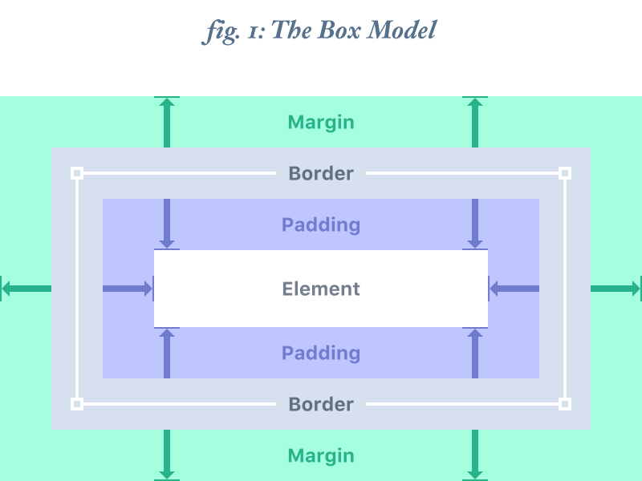

# Osmibodová mřížka

8pt grid jako nástroj konzistentního spacingu a proč na tom záleží.

Související: [Layout: whitespace a kompozice](../layout/layout-theory.md) · [Mřížka a breakpointy](../../enterprise-ui/zaklady/2x-grid-a-breakpointy.md) · [Anti-slop](../pravidla/anti-slop.md)

Jak rychle a efektivně, konzistentně navrhnout uživatelské rozhraní. Hlavně efektivní pro mobilní rozhraní, ale dá se použít i pro webové aplikace

V dnešní době je téměř cokoli, co lze vytvořit v návrhovém nástroji, možné vytvořit i v kódu, ale existuje několik důvodů – od použitelnosti přes časové harmonogramy spuštění až po problémy s výkonem – proč by návrh nemusí být praktické vytvořit.

Nejdůležitější je, jak se vaše návrhy chovají v kódu na uživatelském zařízení, proto upřednostňujte zkrácení doby mezi nápadem a programováním před dokonalým rozvržením ve Sketchi nebo Photoshopu, kdykoli je to možné.

## Krabicový model = Box model
Způsob jak popsat rozměry a okolo objektu
**Skládá se ze 4 prvků**
	Element - samotný prvek
	Padding - prostor mezi hranicemi elemntu a prvky pod ním
	Border - okraj obrysu kolem okrajů prvku. Většina návrhových nástrojů neumožnuje toto ovlivnení
	Margin - Prostor mezi okrajem stránky a hranicemi borderu 

## Body
Bod - pt je jednotka prostoru, která závisí na rozlišení obrazovky. Nejjednodušší vysvětlení je, že při rozlišení „1x“ (nebo @1x) je 1pt = 1px.

Při rozlišení „2x“ (@2x) je 1 - = 4 pixely, protože rozlišení se zdvojnásobí na osách X i Y, takže je 2 pixely na šířku a 2 pixely na výšku.

Při rozlišení „3x“ (@3x), 1 bod = 9 px (3 px x 3 px) a tak dále.

Pixel - nejmenší prvek na displeji
Bod(pt) - logická jednotka, pouzivana programatory a designery, aby zajistili, že bude mit na vsech zarizenich priblizne stejnou fyzickou velikost
Dnešní telefony mají tak jemné displeje, že na plochu, kde dříve byl 1 pixel, se jich dnes vejde 4 nebo 9. Aby obraz nebyl miniaturní, používá se násobení.

Zde je matematický rozklad plochy:

- **@1x (Standard):** 1 bod reprezentuje plochu $1 \times 1$ pixel. Celkem **1 px**.
    
- **@2x (Retina/HighDPI):** 1 bod reprezentuje plochu $2 \times 2$ pixely. Celkem **4 px**.
    
- **@3x (Super Retina/Ultra HighDPI):** 1 bod reprezentuje plochu $3 \times 3$ pixely. Celkem **9 px**.
    

Z hlediska geometrie platí vztah:

$$Počet\ pixelů = (Měřítko)^2 \times Počet\ bodů$$
### Dvě metody

Ve skutečnosti existují dvě prominentní verze tohoto systému. Jedna, která umisťuje prvky do systémem zobrazené mřížky definované v 8bodových krocích (nazveme ji metodou „tvrdé mřížky“), a druhá, která jednoduše měří 8bodové kroky mezi jednotlivými prvky (nazveme ji metodou „měkké mřížky“).

Hlavním argumentem pro metodu Hard Grid je, že použitím dalších průhledných prvků pozadí a jejich následným seskupením do malých skupin prvků popředí můžete sledovat okraje a odsazení pro každý prvek a tyto kontejnery jednoduše přichytit k mřížce jako cihly. Material Design – kde je vše již navrženo do 4bodové mřížky – se této metodě přirozeně přizpůsobuje.

Argumentem pro metodu Soft Grid je, že když přijde čas na kódování rozhraní, použití skutečné mřížky je irelevantní, protože programovací jazyky tento druh mřížkové struktury nepoužívají – prostě se zahodí. Pokud je prioritou rychlost, s jakou dosáhnete vysoce kvalitní, programovatelné sady maket, může být výhodou obcházení dodatečných režijních nákladů Hard Gridu na správu dalších vrstev ve prospěch plynulejší a minimalistické struktury Soft Gridu. To může být také výhodnější pro iOS, kde mnoho prvků uživatelského rozhraní systému není definováno rovnoměrnou mřížkou.

## Proč na tom záleží

### Konzistentní uživatelské rozhraní

Když všechna vaše měření dodržují stejná pravidla, automaticky získáte konzistentnější uživatelské rozhraní.

### Méně rozhodnutí = méně času

Odebráním 7 z každých 8 možností mezer snížíte množství dostupných úprav a následně snížíte rychlost kódu.¨

## Tipy pro implementaci

### Přichytit k mřížce

Téměř každá grafická aplikace má možnost „Přichytit k mřížce“. Pokud používáte metodu pevné mřížky, určitě vám to usnadní práci. V každém případě se ujistěte, že máte povolenou možnost „Přichytit k pixelové mřížce“, pokud je k dispozici.

### Rems a proměnné

Pokud nastavíte velikost kořenového textu na 16, můžete snadno použít přírůstky 0,5 rem k vytvoření rozvržení na 8bodové mřížce.

Pokud to nechcete dělat, nebo se vám nelíbí rems, můžete použít proměnnou mezer v CSS nebo preprocesoru pro zpracování rozvržení a zároveň si zachovat dodatečnou hodnotu údržby, kterou proměnné nabízejí.

### Definujte si mřížku

Většina grafických aplikací umožňuje upravit hodnotu „velkého posunutí“. Já si ho ve Sketchi upravuji od 10 do 8 pomocí aplikace s názvem [Nudg.it.](https://nudg.it/) Je to velmi jednoduchá aplikace, která celý pracovní postup výrazně zrychlí a usnadní.

### Zkratky

Mnoho aplikací má zkratky, které umožňují posouvání, změnu velikosti a úpravu kroků za chodu. Důrazně doporučuji se je naučit – zejména posuny a úpravy velikosti.

######

### Zarámujte si ikony

Ikony často potřebují mít různé velikosti, aby si zachovaly stejnou vizuální váhu. Orámování kolem nich, podobně jako pevná mřížka definuje velikosti prvků, je jednoduchý způsob, jak udržet konzistentní rozměry a zároveň umožnit variaci v rámci definovaných parametrů.

### Přiblížení, oddálení

Pokud trávíte veškerý čas přiblížením na 1600 %, můžete špatně odhadnout vertikální rytmus. Naopak, pokud si uživatelské rozhraní neustále prohlížíte s 50 % přiblížením, můžete přehlédnout důležité detaily, jako je například přizpůsobení pixelů. Často upravujte přiblížení, abyste se ujistili, že vidíte celý obraz.